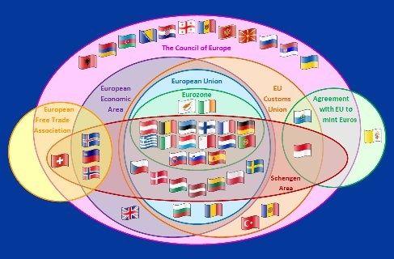

*Réponse publiée [sur Quora](https://fr.quora.com/Est-ce-que-ce-n-est-pas-dangereux-pour-l-UE-d-%C3%A9largir-l-UE-Est-ce-qu-il-ne-faudrait-pas-une-UE-a-plusieurs-vitesses-meme-si-il-y-a-d%C3%A9j%C3%A0-la-zone-euro/answer/Dr-Goulu)*

C'est déjà beaucoup plus compliqué que ça :

Le problème de l'UE, ce sont les votes à l'unanimité.

Comme l'ont montré les problèmes avec Orban en Hongrie ou la Pologne, si un pays peut bloquer ou rançonner les autres, ça ne marche plus.

Avec des votes à la majorité simple ou qualifiée (disons 2/3) le nombre de membres ne a plus vraiment d'importance.
