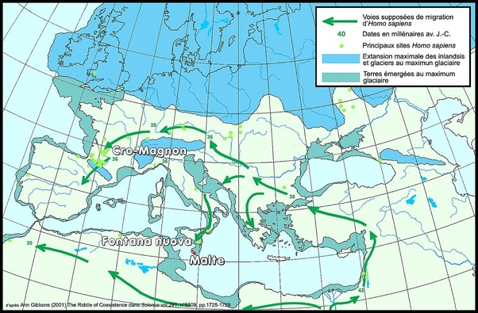

*Réponse publiée [sur Quora](https://fr.quora.com/Comment-les-premiers-habitants-de-Malte-sont-arriv%C3%A9s-%C3%A0-l-%C3%A9poque-pr%C3%A9historique/answer/Dr-Goulu)*

A pied.

Pendant la dernière glaciation, le niveau de la méditerranée était 100 à 120m inférieur à aujourd'hui , comme l'indique par exemple la [Grotte Cosquer](w:)

