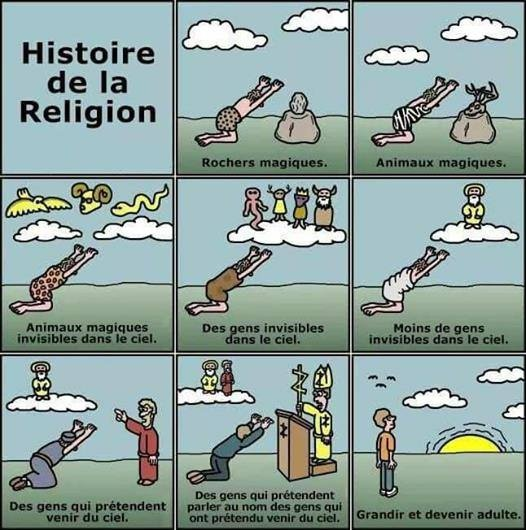

*Réponse publiée [sur Quora](https://fr.quora.com/Pourquoi-le-terme-utilis%C3%A9-pour-d%C3%A9signer-une-personne-qui-ne-croit-pas-en-Dieu-est-il-ath%C3%A9e-alors-qu-il-s-agissait-d-une-%C3%A9tiquette-p%C3%A9jorative-dans-la-Gr%C3%A8ce-antique/answer/Dr-Goulu)*

Dans la Grèce antique, on ne mettait pas de majuscule à dieu parce qu'il y en avait une ribambelle, nom de Zeus !

Les temps changent.

