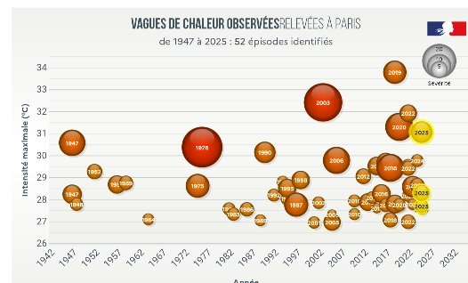

*Réponse publiée [sur Quora](https://fr.quora.com/La-canicule-%C3%A9tait-terrible-mais-n-est-ce-pas-simplement-l-%C3%A9t%C3%A9/answer/Dr-Goulu)*

Si. Les canicules ont lieu en été, en effet.

Si vous aimez l'été, réjouissez vous : il y a de plus en plus de canicules, de plus en plus chaudes , et pendant une période de plus en plus large

Source et version interactive [Comprendre le climat parisien avec Météo-France](https://www.apc-paris.com/changement-climatique/climat-a-paris/comprendre-le-climat-parisien-avec-meteo-france/)
