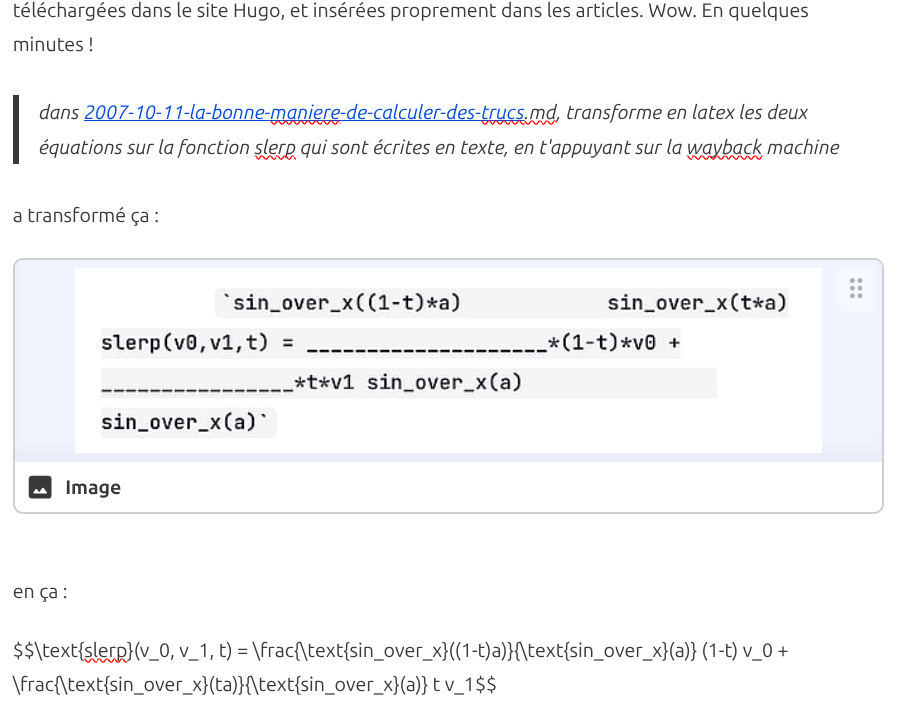

Après plusieurs années de quasi abandon, j'ai décidé de faire revivre ce site pour plusieurs raisons :

1. il tombait en loques et c'était dommage
2. je veux y transférer une bonne partie de l'énorme contenu que j'ai publié [sur Quora](https://fr.quora.com/profile/Dr-Goulu) ces dernières années.
3. j'ai du temps à perdre, et des IA pour m'aider. Les deux se sont révélés indispensables.

## Les problèmes de WordPress

Depuis 2010 ce blog était propulsé par WordPress, qui est devenu un monstre, notamment à cause de la foison de plugins que j'utilisais. Il devenait de plus en plus difficile de gérer les versions, les conflits entre plugins, les mises à jour, et les failles de sécurité, sans compter les bugs de certains, qui ont notamment causé la perte de nombreuses images.

Pourtant, devant l'ampleur de la tâche, j'étais assez réticent à changer de solution. J'ai commencé par copier le site en local sous [LocalWP](https://localwp.com/), ce qui me permettait de farfouiller dans les fichiers sans passer par FTP, et surtout de ne pas abîmer le site en production. J'ai ainsi pu remettre à jour certains plugins indispensables, notamment

* [OpenBook](https://github.com/goulu/openbook) qui a été accepté comme [plugin officiel](https://wordpress.org/plugins/openbook-book-data/) (même si la bannière dit qu'il est obsolète...)
* [Reference 2 Wiki](https://github.com/goulu/reference-2-wiki) pour gérer les milliers de liens vers Wikipédia de drgoulu.com
* [Altmetric](https://github.com/goulu/Altmetric) qui était abandonné
* et le thème [Customizr](https://github.com/goulu/customizr) qui à l'air de l'être car mes "Pull Requests" qui le rendent compatible avec les dernières versions de WP sont ignorées...

Mais même avec tout ça, j'étais encore insatisfait, et attiré par la curiosité : comment faire un blog moderne en 2026 ?

## Les sites "statiques"

La tendance actuelle, est clairement aux [générateur de site statique](w:) : le site est considéré comme un projet informatique qui est "compilé" en pages HTML fixes, "comme dans le temps". Plus de base de données, plus de PHP, plus de failles de sécurité potentielles, et en plus la navigation devient hyper rapide, comme vous vous en apercevez en parcourant ce site...

### Le choix : Hugo

Je suis assez rapidement tombé sur [Hugo](https://gohugo.io/) , mais par acquit de conscience j'ai aussi essayé [Quarto](https://quarto.org/) qui m'a bien tenté pour son orientation scientifique basée sur Python, Jupyter, etc. mais il est surtout utilisé dans le monde académique, et moins pour les blogs généralistes comme le mien.

J'ai aussi examiné [Astro](https://astro.build) , dont la technologie a l'air plus moderne encore, peut-être trop...

Après avoir demandé un [tableau comparatif à une IA](https://share.google/aimode/XGNJvQjEpjzur8hLx), j'ai choisi Hugo dans sa mouture [HugoBlox](https://hugoblox.com), à la fois complète et facile à démarrer.

### Les outils : Git(Hub), VSCode, ...

Pour créer un site, on tape dans un shell :




# Requires Node.js
npm install -g hugoblox
hugoblox create site




et on remplit les champs, et on obtient un dossier de projet avec tout ce qu'il faut dedans.

C'est tout.

Il n'y a plus qu'à écrire des articles en [Markdown](w:), un format de texte enrichi autrefois réservé à de simples fichiers readme.md qui devient très à la mode avec les IA.

A ce moment, il devient très naturel de gérer toutes les modifications apportées au site dans un dépôt git pour être sur de NE PLUS JAMAIS RIEN PERDRE.

Un petit site peut d'ailleurs être très facilement être <a href="https://gohugo.io/host-and-deploy/host-on-github-pages/" target="_blank" rel="noopener">buildé et publié automatiquement sur GitHub pages</a> à chaque push sur GitHub, mais dans le cas de drgoulu.com le build dépassait les 10 minutes autorisées (ce qui est étonnant...) et de toutes façons je voulais le publier chez mon hébergeur (infomaniak)

Donc j'ai plutôt choisi de n'utiliser GitHub que comme repo du projet source (et images...) et de lancer les build en local pousser uniquement le dossier "public" avec les pages HTML générées chez Infomaniak, avec un "hook" qui les met au bon endroit :



#!/bin/sh
# ----------------------------------------------------------------------
# ~/git_depot/drgoulu.git/hooks/post-receive
# Hook post-receive : Déploiement direct des fichiers statiques compilés
# ----------------------------------------------------------------------

# 1. Définir le dossier de destination (le dossier web de votre sous-domaine Hugo)
TARGET="/home/clients/VOTRE_ID_CLIENT/web"

# 2. Définir l'emplacement du dépôt Git distant actuel
GIT_DIR="/home/clients/VOTRE_ID_CLIENT/git_depot/drgoulu.git"

# 3. Extraire les fichiers poussés directement dans le dossier Web
echo "📦 Déploiement des fichiers sur Infomaniak..."
git --work-tree=$TARGET --git-dir=$GIT_DIR checkout -f

echo "✅ Site Hugo mis à jour avec succès !"



### Markdown

Markdown est  l'inconvénient majeur des générateurs de sites statiques , et probablement ce qui limite encore Hugo et ses copains par rapport à WordPress : il n'est pas [wysiwyg](w:). Même si [sa syntaxe](https://www.markdownguide.org) rend le texte plus visuel que du HTML, on ne voit pas le résultat final.

L'approche standard est d'utiliser des plugins de VSCode qui lancent un serveur local et affichent des prévisualisations de la page qu'on édite à chaque "save" de celle-ci

* [Hugo IntelliSense](https://marketplace.visualstudio.com/items?itemName=hugoblox.hugo), qui est tout neuf et pas très convaincant pour l'instant
* [Ownable](https://ownable.dev) plus abouti actuellement me semble t'il, mais pas encore top.

Sinon, il existe bien des choses comme [Cloudcannon](cloudcannon.com), un éditeur et gestionnaire de site Hugo en ligne via GitHub, que j'utilise pour écrire ces lignes parce qu'il est gratuit pendant 20 jours, mais assez cher ensuite, ce qui fait que je ne vais pas le garder, hélas.

Et il fait un rendu un peu intermédiaire, certaines choses étant wysiwyg et d'autres pas. Voici par exemple un extrait du présent article tel que je le vois dans Cloudcannon:



### Les Shortcodes

La difficulté tient aux "shortcodes" qui permettent d'étendre Markdown pour afficher du code formaté, des videos YouTube etc.

## LA MIGRATION

### IA = Indispensable Assistant

Franchement, sans l'IA (Gemini) intégrée dans Antigravity (l'IDE que j'utilise de préférence à VSCode), j'aurais abandonné.

Elle a permis de faire des dizaines de recherche/remplace qui m'auraient pris de heures à la main ou à écrire les regex en quelques minutes.

Le plus incroyable s'est produit lorsque je lui ai demandé de retrouver des images qui avaient disparu car je les avais "hotlinké" sans m'en rendre compte, et que le site d'origine avait bien entendu changé ou disparu. L'IA a pensé "toute seule" à les chercher sur la Wayback Machine qui conserve les anciennes versions de pratiquement tout internet ! Et les a toutes retrouvées, téléchargées dans le site Hugo, et insérées proprement dans les articles. Wow. En quelques minutes !

> dans [2007-10-11-la-bonne-maniere-de-calculer-des-trucs](dans%202007-10-11-la-bonne-maniere-de-calculer-des-trucs).md, transforme en latex les deux équations sur la fonction slerp qui sont écrites en texte, en t'appuyant sur la wayback machine

a transformé ça :


en ça :

$$\text{slerp}(v_0, v_1, t) = \frac{\text{sin_over_x}((1-t)a)}{\text{sin_over_x}(a)} (1-t) v_0 + \frac{\text{sin_over_x}(ta)}{\text{sin_over_x}(a)} t v_1$$

et

> reformate le contenu de tous les shortcodes highlight en reproduisant celui trouvé dans la wayback machine

a transformé ça :


en ça :




def r(a): i=a.find('0') if i<0:print a [m in[(i-j)%9*(i/9^j/9)*(i/27^j/27|i%9/3^j%9/3)or a[j]for j in range(81)]or r(a[:i]+m+a[i+1:])for m in`14**7*9`]r(raw_input())



(mauvais exemple car le code est sur une seule ligne...)

## Commentaires Disqus

L'intégration des commentaires historiques du blog repose sur [Disqus](https://disqus.com/). Lors de la migration vers Hugo Blox / Tailwind CSS, un problème d'incompatibilité est apparu :

### Incompatibilité OKLCH et Disqus `embed.js`

Le script d'intégration de Disqus (`embed.js`) analyse automatiquement l'environnement de la page (`getComputedStyle`) pour adapter les couleurs du fil de discussion (mode clair/sombre, couleur des liens).

Or, Tailwind CSS et Hugo Blox utilisent désormais le format de couleur moderne `oklch(...)`. Le parseur interne de Disqus (`parseColor`), n'étant pas compatible avec `oklch`, échouait avec l'erreur :

```text
Uncaught Error: parseColor received unparseable color: oklch(...)
```

### Solution mise en place

Pour isoler Disqus des styles `oklch` globaux, des règles CSS explicites ont été ajoutées dans `assets/css/custom.css` afin de forcer des formats de couleurs traditionnels (Hex / RGB) sur le conteneur `#disqus_thread`, son texte d'arrière-plan et ses liens internes (`#disqus_thread a`), pour les thèmes clair et sombre :



/* Forcer des couleurs standards (Hex/RGB) pour Disqus */
#disqus_thread,
#disqus_thread * {
  color: #111827 !important;
}

#disqus_thread {
  background-color: #ffffff !important;
}

#disqus_thread a,
#disqus_thread a:link,
#disqus_thread a:visited,
#disqus_thread a:hover,
#disqus_thread a:active,
.dsq-brlink,
.dsq-brlink a {
  color: #2563eb !important;
}

.dark #disqus_thread,
.dark #disqus_thread * {
  color: #f8fafc !important;
}

.dark #disqus_thread {
  background-color: #0f172a !important;
}

.dark #disqus_thread a,
.dark #disqus_thread a:link,
.dark #disqus_thread a:visited,
.dark #disqus_thread a:hover,
.dark #disqus_thread a:active,
.dark .dsq-brlink,
.dark .dsq-brlink a {
  color: #60a5fa !important;
}



## Références:

- [Migration de Wordpress vers Hugo](https://www.hleroy.com/2022/09/migration-de-wordpress-vers-hugo/), article de blog duquel j'ai copié l'image d'entête
