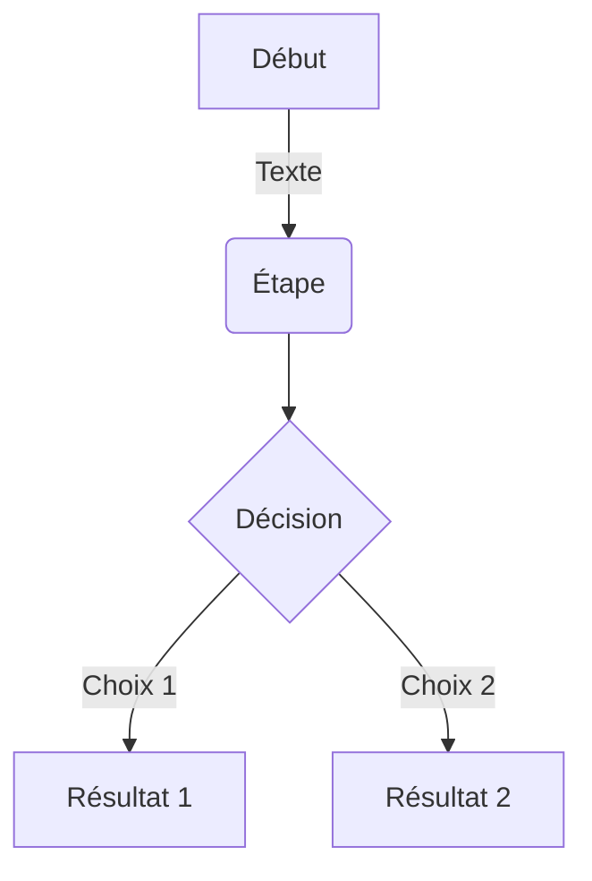
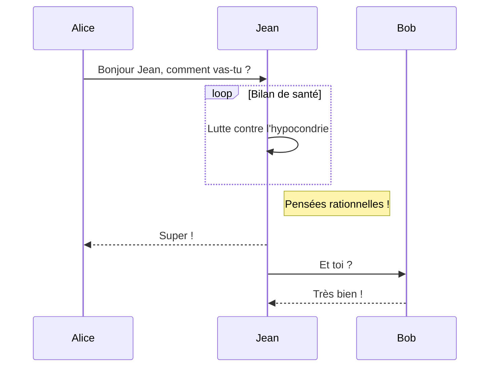
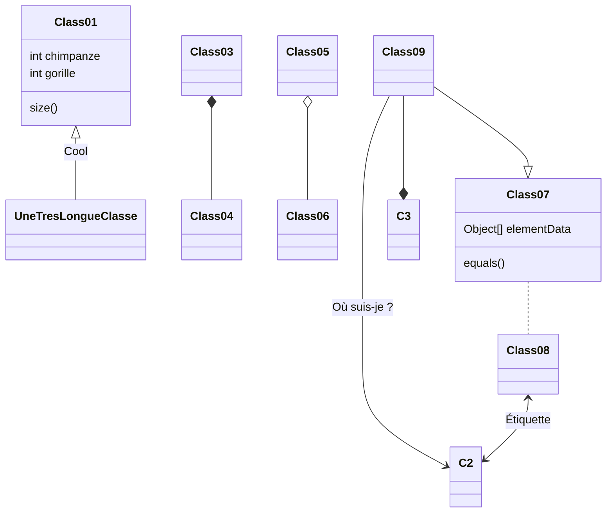
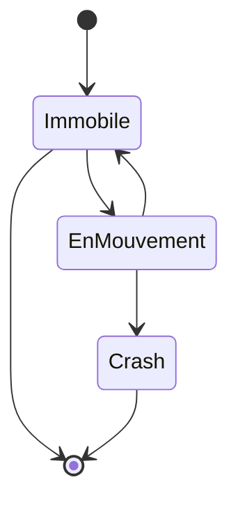

Après plusieurs années de quasi abandon, j'ai décidé de faire revivre ce site pour plusieurs raisons :

1) il tombait en loques et c'était dommage
2) je veux y transférer une bonne partie de l'énorme contenu que j'ai publié [sur Quora](https://fr.quora.com/profile/Dr-Goulu) ces dernières années. 
3) j'ai du temps à perdre, et des IA pour m'aider. Ca s'est révélé indispensable.

## les problèmes avec Wordpress
Depuis 2010 ce blog était propulsé par Wordpress, qui est devenu un monstre, notamment à cause de la foison de plugins que j'utilisais. Il devenait de plus en plus difficile de gérer les versions, les conflits entre plugins, les mises à jour, et les failles de sécurité, sans compter les bugs de certains, qui ont notamment causé la perte de nombreuses images.

Pourtant, devant l'ampleur de la tâche, j'étais assez réticent à changer de solution. J'ai commencé par copier le site en local sous [LocalWP](https://localwp.com/), ce qui me permettait de farfouiller dans les fichiers sans passer par FTP, et surtout de ne pas abîmer le site en production. J'ai ainsi pu remettre à jour certains plugins indispensables, notamment

* [OpenBook](https://github.com/goulu/openbook) qui a été accepté comme [plugin officiel](https://wordpress.org/plugins/openbook-book-data/) (même si la bannière dit qu'il est obsolète...)
* [Reference 2 Wiki](https://github.com/goulu/reference-2-wiki) pour gérer les milliers de liens vers Wikipédia de drgoulu.com
* [Altmetric](https://github.com/goulu/Altmetric) qui était abandonné
* et le thème [Customizr]( https://github.com/goulu/customizr) qui à l'air de l'être car mes "Pull Requests" qui le rendent compatible avec les dernières versions de WP sont ignorées...

Mais même avec tout ça, j'étais encore insatisfait, et attiré par la curiosité : comment faire un blog moderne en 2026 ?

## le choix de Hugo

La tendance actuelle, est clairement au [générateur de site statique](w:) : le site est considéré comme un projet informatique qui est "compilé" en pages HTML fixes, "comme dans le temps". Plus de base de données, plus de PHP, plus de failles de sécurité potentielles, et en plus la navigation devient hyper rapide, comme vous vous en apercevez en parcourant ce site...

Je suis assez rapidement tombé sur [Hugo](https://gohugo.io/) , mais par acquit de conscience j'ai aussi essayé [Quarto](https://quarto.org/) qui m'a bien tenté pour son orientation scientifique basée sur Python, Jupyter, etc. mais il est surtout utilisé dans le monde académique, et moins pour les blogs généralistes comme le mien. De plus il faut installer [Positron, un n-ième IDE](https://positron.posit.co) pour l'éditer. Ca a beau être très similaire à VS Code, j'ai préféré une solution utilisant une extension de VS Code, en l'occurence [Hugo Blox](https://gitlab.com/joomlakove/hugoblox-vscode-extension).


Voici comment j'ai pu migrer le site de Wordpress à Hugo Blox.

## Graphiques (Charts)

Hugo Blox prend en charge le format populaire [Plotly](https://plot.ly/) pour les visualisations de données interactives. Avec Plotly, vous pouvez concevoir presque tous les types de visualisations imaginables !

Enregistrez votre fichier JSON Plotly dans le dossier de votre page (par exemple `line-chart.json`), puis ajoutez le shortcode `` à l'endroit où vous souhaitez faire apparaître le graphique.

Vous pouvez également utiliser le [Plotly JSON Editor](http://plotly-json-editor.getforge.io/) pour préparer vos données.

## Diagrammes (Mermaid)

Hugo Blox prend en charge l'extension Markdown _Mermaid_ pour les diagrammes.

### Organigramme (Flowchart)

Exemple de syntaxe :

    ```mermaid
    graph TD
    A[Début] -->|Texte| B(Étape)
    B --> C{Décision}
    C -->|Choix 1| D[Résultat 1]
    C -->|Choix 2| E[Résultat 2]
    ```

Rendu :



### Diagramme de séquence (Sequence diagram)

Exemple de syntaxe :

    ```mermaid
    sequenceDiagram
    Alice->>Jean: Bonjour Jean, comment vas-tu ?
    loop Bilan de santé
        Jean->>Jean: Lutte contre l'hypocondrie
    end
    Note right of Jean: Pensées rationnelles !
    Jean-->>Alice: Super !
    Jean->>Bob: Et toi ?
    Bob-->>Jean: Très bien !
    ```

Rendu :



### Diagramme de classes (Class diagram)

Exemple de syntaxe :

    ```mermaid
    classDiagram
    Class01 <|-- UneTresLongueClasse : Cool
    Class03 *-- Class04
    Class05 o-- Class06
    Class07 .. Class08
    Class09 --> C2 : Où suis-je ?
    Class09 --* C3
    Class09 --|> Class07
    Class07 : equals()
    Class07 : Object[] elementData
    Class01 : size()
    Class01 : int chimpanze
    Class01 : int gorille
    Class08 <--> C2: Étiquette
    ```

Rendu :



### Diagramme d'états (State diagram)

Exemple de syntaxe :

    ```mermaid
    stateDiagram
    [*] --> Immobile
    Immobile --> [*]
    Immobile --> EnMouvement
    EnMouvement --> Immobile
    EnMouvement --> Crash
    Crash --> [*]
    ```

Rendu :



## Tableaux de données (Data Frames / CSV)

Enregistrez votre feuille de calcul sous forme de fichier CSV dans le dossier de votre page, puis affichez-la en ajoutant le shortcode _Table_ à votre page :

```go

```

## Reference 2 Wiki

Cette fonctionnalité remplace et modernise l'ancien plugin WordPress [reference-2-wiki](https://github.com/goulu/reference-2-wiki). Tout lien vers Wikipédia bénéficie automatiquement du style avec le symbole **ⓦ** et s'ouvre dans un nouvel onglet (`target="_blank"`).

### 1. Raccourcis de liens Markdown (Recommandé)

Vous pouvez utiliser le préfixe `w:` (ou `wiki:`) directement dans la syntaxe standard des liens Markdown :

| Syntaxe Markdown                                                        | Rendu HTML / Lien cible                                               | Description                          |
| :---------------------------------------------------------------------- | :-------------------------------------------------------------------- | :----------------------------------- |
| `[fusion thermonucléaire](w:)`                                          | [fusion thermonucléaire](w:)                                          | Article FR basé sur le texte du lien |
| `[Paul Davies](w:Paul_Davies_(physicien))`                              | [Paul Davies](<w:Paul_Davies_(physicien)>)                            | Article FR avec texte différent      |
| `[Bigelow Aerospace](w:en)`                                             | [Bigelow Aerospace](w:en)                                             | Article EN basé sur le texte du lien |
| `[Dr. Hal E. Puthoff](w:en:Harold_E._Puthoff)`                          | [Dr. Hal E. Puthoff](w:en:Harold_E._Puthoff)                          | Article EN avec texte différent      |
| `[Dr. Hal E. Puthoff](https://en.wikipedia.org/wiki/Harold_E._Puthoff)` | [Dr. Hal E. Puthoff](https://en.wikipedia.org/wiki/Harold_E._Puthoff) | URL complète (style ⓦ automatique)   |

### 2. Shortcodes Hugo

Vous pouvez également utiliser le shortcode `` (ou son alias ``) :

- `` : lien vers l'article en français
- `` : article FR avec texte personnalisé
- `` : article EN avec texte personnalisé
- `` : format compact séparé par des barres `|`

## Images flottantes et légendes (Figure Shortcode)

Ce shortcode remplace les anciennes balises WordPress `[caption ...]` pour insérer des images flottantes avec légende, redimensionnement et optimisation responsive automatique.

### Syntaxe et Paramètres

```go

```

| Paramètre | Description                                                                                            | Valeur par défaut    |
| :-------- | :----------------------------------------------------------------------------------------------------- | :------------------- |
| `src`     | Chemin de l'image (`images/nom.jpg`, `media/...` ou URL externe)                                       | _(obligatoire)_      |
| `caption` | Texte de la légende affiché en dessous de l'image                                                      | _(vide)_             |
| `alt`     | Texte alternatif pour l'accessibilité                                                                  | _(texte du caption)_ |
| `align`   | Alignement : `alignright` (flottant à droite), `alignleft` (flottant à gauche), `aligncenter` (centré) | `alignright`         |
| `width`   | Largeur maximale en pixels (ex: `400` ou `400px`)                                                      | Largeur naturelle    |
| `link`    | URL optionnelle pour rendre l'image cliquable                                                          | _(aucun)_            |

### Exemples d'utilisation

**Image flottante à droite avec largeur définie et légende :**

```go

```

**Image cliquable centrée avec lien :**

```go

```

> [!NOTE]
> **Adaptation Mobile :** Sur les écrans de smartphone (< 640px), les images flottantes (`alignright` et `alignleft`) repassent automatiquement en pleine largeur centrée pour une lecture confortable.

## Vidéos YouTube (YouTube Shortcode)

Les vidéos YouTube peuvent être intégrées avec adaptation automatique au ratio 16:9, respect de la vie privée (`youtube-nocookie.com`) et limitation optionnelle de la largeur maximale :

### Syntaxe et Paramètres

```go

```

| Paramètre | Description                                         | Valeur par défaut                   |
| :-------- | :-------------------------------------------------- | :---------------------------------- |
| `id`      | Identifiant de la vidéo YouTube (ex: `yfwb39VCNcQ`) | _(obligatoire)_                     |
| `width`   | Largeur maximale en pixels (ex: `640` ou `640px`)   | `760px` (pleine largeur de colonne) |
| `title`   | Titre accessible de la vidéo                        | `YouTube video player`              |

## Commentaires Disqus

L'intégration des commentaires historiques du blog repose sur [Disqus](https://disqus.com/). Lors de la migration vers Hugo Blox / Tailwind CSS, un problème d'incompatibilité est apparu :

### Incompatibilité OKLCH et Disqus `embed.js`

Le script d'intégration de Disqus (`embed.js`) analyse automatiquement l'environnement de la page (`getComputedStyle`) pour adapter les couleurs du fil de discussion (mode clair/sombre, couleur des liens).

Or, Tailwind CSS et Hugo Blox utilisent désormais le format de couleur moderne `oklch(...)`. Le parseur interne de Disqus (`parseColor`), n'étant pas compatible avec `oklch`, échouait avec l'erreur :

```text
Uncaught Error: parseColor received unparseable color: oklch(...)
```

### Solution mise en place

Pour isoler Disqus des styles `oklch` globaux, des règles CSS explicites ont été ajoutées dans `assets/css/custom.css` afin de forcer des formats de couleurs traditionnels (Hex / RGB) sur le conteneur `#disqus_thread`, son texte d'arrière-plan et ses liens internes (`#disqus_thread a`), pour les thèmes clair et sombre :

```css
/* Forcer des couleurs standards (Hex/RGB) pour Disqus */
#disqus_thread,
#disqus_thread * {
  color: #111827 !important;
}

#disqus_thread {
  background-color: #ffffff !important;
}

#disqus_thread a,
#disqus_thread a:link,
#disqus_thread a:visited,
#disqus_thread a:hover,
#disqus_thread a:active,
.dsq-brlink,
.dsq-brlink a {
  color: #2563eb !important;
}

.dark #disqus_thread,
.dark #disqus_thread * {
  color: #f8fafc !important;
}

.dark #disqus_thread {
  background-color: #0f172a !important;
}

.dark #disqus_thread a,
.dark #disqus_thread a:link,
.dark #disqus_thread a:visited,
.dark #disqus_thread a:hover,
.dark #disqus_thread a:active,
.dark .dsq-brlink,
.dark .dsq-brlink a {
  color: #60a5fa !important;
}
```
