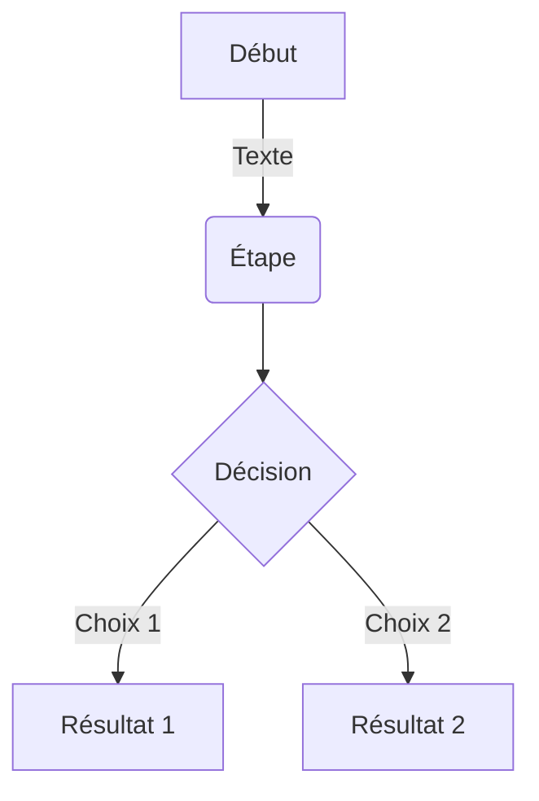
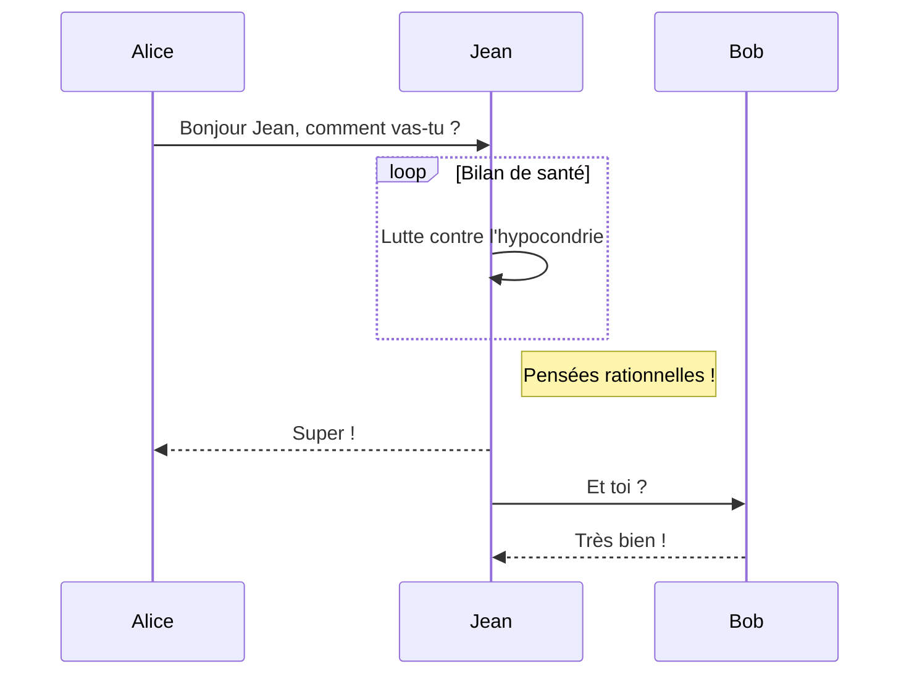
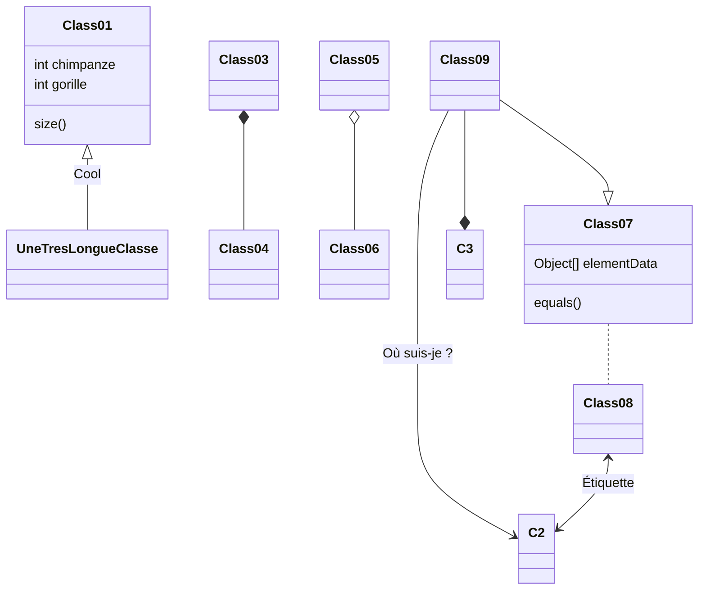
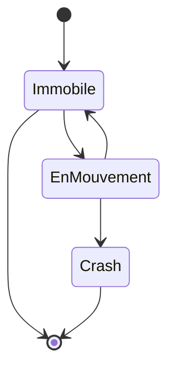

Hugo Blox est conçu pour offrir aux créateurs de contenu technique une expérience fluide. Vous pouvez vous concentrer sur le contenu et Hugo Blox s'occupe du reste.

Utilisez des outils populaires tels que Plotly, Mermaid et les tableaux de données (Data Frames).

## Graphiques (Charts)

Hugo Blox prend en charge le format populaire [Plotly](https://plot.ly/) pour les visualisations de données interactives. Avec Plotly, vous pouvez concevoir presque tous les types de visualisations imaginables !

Enregistrez votre fichier JSON Plotly dans le dossier de votre page (par exemple `line-chart.json`), puis ajoutez le shortcode `` à l'endroit où vous souhaitez faire apparaître le graphique.

Vous pouvez également utiliser le [Plotly JSON Editor](http://plotly-json-editor.getforge.io/) pour préparer vos données.

## Diagrammes (Mermaid)

Hugo Blox prend en charge l'extension Markdown _Mermaid_ pour les diagrammes.

### Organigramme (Flowchart)

Exemple de syntaxe :

    ```mermaid
    graph TD
    A[Début] -->|Texte| B(Étape)
    B --> C{Décision}
    C -->|Choix 1| D[Résultat 1]
    C -->|Choix 2| E[Résultat 2]
    ```

Rendu :



### Diagramme de séquence (Sequence diagram)

Exemple de syntaxe :

    ```mermaid
    sequenceDiagram
    Alice->>Jean: Bonjour Jean, comment vas-tu ?
    loop Bilan de santé
        Jean->>Jean: Lutte contre l'hypocondrie
    end
    Note right of Jean: Pensées rationnelles !
    Jean-->>Alice: Super !
    Jean->>Bob: Et toi ?
    Bob-->>Jean: Très bien !
    ```

Rendu :



### Diagramme de classes (Class diagram)

Exemple de syntaxe :

    ```mermaid
    classDiagram
    Class01 <|-- UneTresLongueClasse : Cool
    Class03 *-- Class04
    Class05 o-- Class06
    Class07 .. Class08
    Class09 --> C2 : Où suis-je ?
    Class09 --* C3
    Class09 --|> Class07
    Class07 : equals()
    Class07 : Object[] elementData
    Class01 : size()
    Class01 : int chimpanze
    Class01 : int gorille
    Class08 <--> C2: Étiquette
    ```

Rendu :



### Diagramme d'états (State diagram)

Exemple de syntaxe :

    ```mermaid
    stateDiagram
    [*] --> Immobile
    Immobile --> [*]
    Immobile --> EnMouvement
    EnMouvement --> Immobile
    EnMouvement --> Crash
    Crash --> [*]
    ```

Rendu :



## Tableaux de données (Data Frames / CSV)

Enregistrez votre feuille de calcul sous forme de fichier CSV dans le dossier de votre page, puis affichez-la en ajoutant le shortcode _Table_ à votre page :

```go

```

## Reference 2 Wiki

Cette fonctionnalité remplace et modernise l'ancien plugin WordPress [reference-2-wiki](https://github.com/goulu/reference-2-wiki). Tout lien vers Wikipédia bénéficie automatiquement du style avec le symbole **ⓦ** et s'ouvre dans un nouvel onglet (`target="_blank"`).

### 1. Raccourcis de liens Markdown (Recommandé)

Vous pouvez utiliser le préfixe `w:` (ou `wiki:`) directement dans la syntaxe standard des liens Markdown :

| Syntaxe Markdown | Rendu HTML / Lien cible | Description |
| :--- | :--- | :--- |
| `[fusion thermonucléaire](w:)` | [fusion thermonucléaire](w:) | Article FR basé sur le texte du lien |
| `[Paul Davies](w:Paul_Davies_(physicien))` | [Paul Davies](w:Paul_Davies_(physicien)) | Article FR avec texte différent |
| `[Bigelow Aerospace](w:en)` | [Bigelow Aerospace](w:en) | Article EN basé sur le texte du lien |
| `[Dr. Hal E. Puthoff](w:en:Harold_E._Puthoff)` | [Dr. Hal E. Puthoff](w:en:Harold_E._Puthoff) | Article EN avec texte différent |
| `[Dr. Hal E. Puthoff](https://en.wikipedia.org/wiki/Harold_E._Puthoff)` | [Dr. Hal E. Puthoff](https://en.wikipedia.org/wiki/Harold_E._Puthoff) | URL complète (style ⓦ automatique) |

### 2. Shortcodes Hugo

Vous pouvez également utiliser le shortcode `` (ou son alias ``) :

- `` : lien vers l'article en français
- `` : article FR avec texte personnalisé
- `` : article EN avec texte personnalisé
- `` : format compact séparé par des barres `|`

## Images flottantes et légendes (Figure Shortcode)

Ce shortcode remplace les anciennes balises WordPress `[caption ...]` pour insérer des images flottantes avec légende, redimensionnement et optimisation responsive automatique.

### Syntaxe et Paramètres

```go

```

| Paramètre | Description | Valeur par défaut |
| :--- | :--- | :--- |
| `src` | Chemin de l'image (`images/nom.jpg`, `media/...` ou URL externe) | *(obligatoire)* |
| `caption` | Texte de la légende affiché en dessous de l'image | *(vide)* |
| `alt` | Texte alternatif pour l'accessibilité | *(texte du caption)* |
| `align` | Alignement : `alignright` (flottant à droite), `alignleft` (flottant à gauche), `aligncenter` (centré) | `alignright` |
| `width` | Largeur maximale en pixels (ex: `400` ou `400px`) | Largeur naturelle |
| `link` | URL optionnelle pour rendre l'image cliquable | *(aucun)* |

### Exemples d'utilisation

**Image flottante à droite avec largeur définie et légende :**
```go

```

**Image cliquable centrée avec lien :**
```go

```

> [!NOTE]
> **Adaptation Mobile :** Sur les écrans de smartphone (< 640px), les images flottantes (`alignright` et `alignleft`) repassent automatiquement en pleine largeur centrée pour une lecture confortable.

## Vidéos YouTube (YouTube Shortcode)

Les vidéos YouTube peuvent être intégrées avec adaptation automatique au ratio 16:9, respect de la vie privée (`youtube-nocookie.com`) et limitation optionnelle de la largeur maximale :

### Syntaxe et Paramètres

```go

```

| Paramètre | Description | Valeur par défaut |
| :--- | :--- | :--- |
| `id` | Identifiant de la vidéo YouTube (ex: `yfwb39VCNcQ`) | *(obligatoire)* |
| `width` | Largeur maximale en pixels (ex: `640` ou `640px`) | `760px` (pleine largeur de colonne) |
| `title` | Titre accessible de la vidéo | `YouTube video player` |


