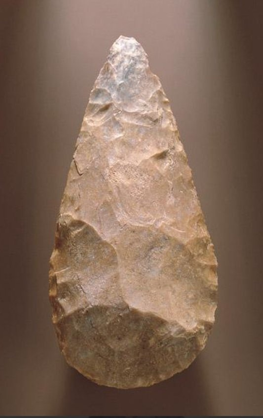

_Réponse publiée_ [_sur Quora_](https://fr.quora.com/Ce-t%C3%A9l%C3%A9phone-a-cent-cinquante-ans-Combien-de-temps-durera-votre-smartphone/answer/Dr-Goulu)

Le téléphone de la photo de [Laurent](https://fr.quora.com/profile/Laurent-737) ne fonctionne plus. Sur aucun réseau téléphonique du monde, depuis longtemps. Regardez le , il n'a même pas de cadran : il fallait des opératrices pour vous connecter manuellement au "22 à Asnières"…



Pour fixer les idées, en 1900, la France avait environ 56 000 abonnés au téléphone pour une population de 40 millions d'habitants, soit à peine 0,14 %.

Le téléphone était un produit de très grand luxe. L'abonnement annuel et les frais d'installation coûtaient plusieurs centaines de francs de l'époque, ce qui représentait parfois plusieurs mois de salaire d'un ouvrier.

Je suis actuellement au Sri Lanka et mon chauffeur de tuktuk aujourd'hui avait deux smartphones…

Si je mets mon smartphone dans un musée actuellement, il sera lui aussi parfaitement en parfait état dans 150 ans, et lui aussi tout à fait inutilisable.

De plus, le téléphone ne permettait que de téléphoner. En local. Parce que le premier service commercial à travers l'Atlantique date de 1927 par ondes radio puis le premier câble sous-marin physique en 1956.

Aujourd'hui mon smartphone cumule un nombre d'outils inimaginable il y a seulement 50 ans ou d'un coût astronomique : Cartographie et localisation dans le monde entier, moyen de paiement et terminal bancaire, traduction quasi instantané en toutes les langued etc.

Quasiment plus personne ne téléphone avec son téléphone…

Même en changeant de smartphone chaque année, il me coûterait moins cher que l'abonnement de téléphone chez l'opérateur historique et mes frais de connexion avec mon modem dans les années 1990.

Ce silex est parfaitement fonctionnel après 45'000 ans. Et votre centre d'usinage à commande numérique ?
