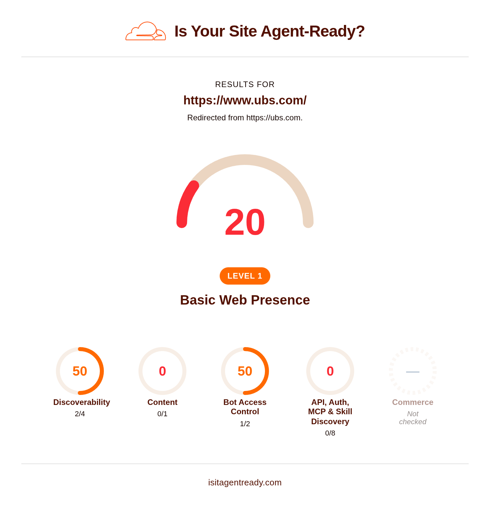
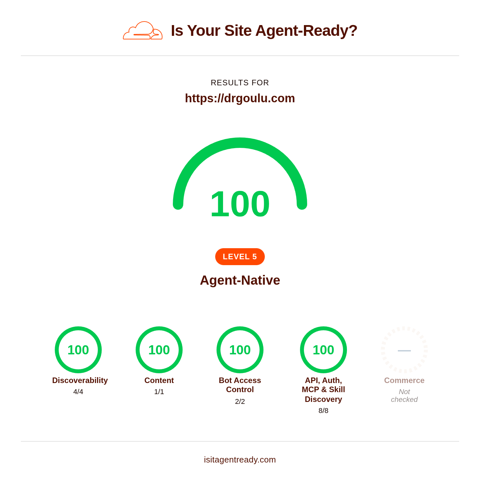

Sur l'ancien drgoulu.com, j'utilisais Google Analytics pour obtenir les statistiques sur l'accès au site. J'aurais pu continuer avec eux, mais

1. je suis dans un processus de deGAFAMisation
2. j'étais intrigué depuis quelques temps par ce petit widget



[Cloudflare](w:) est surtout connu pour ses fonctions de sécurité, mais en investiguant j'ai vu qu'ils proposent des statistiques semblables à celle de Google Analytics, mais aussi bien plus que ça, même avec un compte gratuit,

Ils ont notamment [isitagentready.com](https://isitagentready.com/drgoulu.com), un site qui analyse votre site web pour voir si les agents IA peuvent le lire, voire utiliser l'API du site pour faire des choses...

Au début, drgoulu.com était fermé comme une banque suisse :

[](https://isitagentready.com/ubs.com)

(j'ai oublié de faire une capture d'écran de l'état initial, mais elle ressemblait à ça)

## Peut mieux faire

Je voulais surtout que les IA des moteurs de recherche trouvent mon contenu puisqu'on voit de plus en plus que les recherches par IA remplacent les recherches "simples".

Pour ça il faut surtout la :

### Markdown Negotiation

Les IA parlent [Markdown](w:). C'est le format de leurs sorties texte, mais aussi de leurs "prompts" d'entrée et de tous les textes qu'elles peuvent lire facilement. Pas le HTML, trop fantaisiste et peu structuré. Du Markdown ou rien.

Donc pour la plupart des sites, il faut un truc qui convertit le HTML d'une page en Markdown pour IA. Sur Wordpress, il y a des plugins comme [LLM Markdown](https://wordpress.org/plugins/llm-markdown/) qui font ça, sinon Cloudflare a un outil [Markdown for agents](https://developers.cloudflare.com/fundamentals/reference/markdown-for-agents/) qui le fait pour n'importe quel site, mais il faut un compte payant...

Mais après avoir [migré sous Hugo](/2026/08/24/migration/), mon contenu est déjà en Markdown ! Simplement il n'est pas sur drgoulu.com mais [sur GitHub](https://github.com/drgoulu/drgoulu.com) ... 

"Il suffit de" dire à Cloudflare d'aller chercher sur GitHub le Markdown correspondant à chaque page HTML sur drgoulu.com. Ca se fait avec un "worker", un petit bout de code que Cloudflare exécute sur toute requête idoine, et voilà ! C'est gratuit et ça prend moins d'une milliseconde (!!!) par requête:


### robots.txt (avec Content-Signal)

je crois que c'est Google qui avait lancé ça il y a longtemps. robots.txt est un petit fichier  présent sur tous les sites web qui dit aux moteurs de recherche quoi indexer.

Le mien contient désormais:


User-agent: \*
Disallow: /admin/
Content-Signal: ai-train=yes, search=yes, ai-input=yes
Sitemap: {{ "sitemap.xml" | absURL }}


Avec l'arrivée des IA et sur le conseil de [isitagentready](https://isitagentready.com/drgoulu.com), j'ai rajouté la ligne :

`Content-Signal: ai-train=yes, search=yes, ai-input=yes`

C'est elle qui dit aux IA bien élevées [ce qu'elles ont le droit de faire](https://contentsignals.org) avec le contenu du site, ou pas.

J'ai un peu hésité sur `ai-train` qui permet aux IA d'apprendre à partir du contenu du site. Et puis je me suis dit que mon contenu était publié sous licence [Creative Commons](/2013/01/26/acanthapis-petax-cc-et-wikipedia/)  [CC-BY-NC-SA](http://creativecommons.org/licenses/by-nc-sa/3.0/ch/deed.fr), donc que pour autant qu''une IA me cite comme source de temps à autres, elle pouvait apprendre des choses aussi bien que vous ;-)

A ce stade c'était déjà pas mal :



### API, Auth, MCP & Skill Discovery

A priori je ne voyais pas trop l'intérêt d'aller plus loin en expliquant à des IA qu'elles ne pouvaient rien faire d'autre que lire mon site pour s'instruire, mais tant qu'à faire, j'ai ajouté :

- [/.well-known/api-catalog](https://drgoulu.com/.well-known/api-catalog) qui dit que drgoulu.com n'a pas d'API
- [/.well-known/openid-configuration](https://drgoulu.com/.well-known/openid-configuration) qui dit comment un utilisateur pourrait se connecter au site. (Ce n'est pas le cas)
- [/.well-known/oauth-protected-resource](https://drgoulu.com/.well-known/oauth-protected-resource)
- tout ça est résumé dans [/auth.md](https://drgoulu.com/auth.md) en markdown pour les IA, qui peuvent ainsi éviter de ressembler à des hackers attaquant un site pour comprendre son contenu
- [/.well-known/mcp/server-card.json](https://drgoulu.com/.well-known/mcp/server-card.json). Quoi de mieux qu'[une autre IA pour décrire sa fonction](https://share.google/aimode/zZ6LW4PMe9kDEKAPU) ?
- [/.well-known/agent-skills/index.json](https://drgoulu.com/.well-known/agent-skills/index.json) , [.well-known/agent-skills/mcp-tools/SKILL.md](https://drgoulu.com/.well-known/agent-skills/mcp-tools/SKILL.md) et [.well-known/agent-skills/search-articles/SKILL.md](https://drgoulu.com/.well-known/agent-skills/search-articles/SKILL.md)

#### Et là j'ai été scié !

Dans mon petit esprit humain limité, j'ai toujours pensé que drgoulu.com ne servait qu'à communiquer ma prose. Je n'y voyais aucune autre utilité, aucune fonction interactive (à part les commentaires, mais ils sont délégués à disqus.com)

J'ai oublié le moteur de recherche !

La bête petit loupe là-haut de la fenêtre vous permet de rechercher des articles sur drgoulu.com super vite grâce à un index tout cuit. Pourquoi une IA ne l'utiliserait-elle pas plutôt que de tout réindexer chez elle ? Surtout qu'en plus, il y a une astuce technique qui lui permet de récupérer les résultats directement en markdown !

````plain
For any article URL on `drgoulu.com`, 
request the page with an `Accept: text/markdown` header 
to receive the raw markdown content directly:

```http
GET /2026/09/slug/ HTTP/1.1
Host: drgoulu.com
Accept: text/markdown
```
````

### WebMCP et ARD (Agentic Resource Discovery)

[WebMCP](https://webmachinelearning.github.io/webmcp/) est un standard permettant de fournir des outils JavaScript à des IA. Concrètement, le fichier [webmcp.html](https://github.com/drgoulu/drgoulu.com/blob/main/layouts/_partials/hooks/head-end/webmcp.html) est ajouté à toutes les pages de drgoulu.com pour donner un accès au moteur de recherche interne du site. Franchement je n'aime pas trop ça, ça alourdit un peu le code des pages et je ne vois pas trop l'intérêt pour l'instant.

Par contre l'ARD est implanté par un simple fichier [.well-known/ai-catalog.json](https://drgoulu.com/.well-known/ai-catalog.json) qui résume tout ce qui précède sous une autre forme.

J'ai découvert et appris plein de choses, mais mon impression est que c'est encore un peu un fouillis de "standards" qui vont encore évoluer.

Mais 

## Jamais sans les IA !

Honnêtement, je ne me serais jamais lancé dans cette aventure sans les IA, et notamment celle embarquée dans Cloudflare qui est remarquable. Il y a tellement de trucs à configurer dans les paramètres DNS, dans le .htaccess du site, et tellement de petits bouts de code qui doivent se causer sans (?) trou de sécurité que même un expert sans IA aurait mis plus longtemps que moi avec, j'en suis convaincu.

Il y a notamment eu une récursion infinie lors de la résolution du path de [https://drgoulu.com/auth.md](https://drgoulu.com/auth.md) par le worker qui était bien gratinée, je ne sais pas comment j'aurais pu résoudre ça en moins de trois heures. Là ça a quand même pris 10 minutes à une IA spécialisée pour trouver le bug et le corriger...

ce qui est assez extraordinaire, c'est la capacité des IA actuelles à générer des "prompts" pour d'autres IA. En gros celle de Cloudflare me disait 

> copiez/collez ça dans l'IA d'infomaniak puis revenez ici cliquer sur le bouton "continue"

puis

> copiez/collez ça dans l'IA de votre IDE de développement et revenez pour les tests

etc. Voilà un exemple d'un tel prompt :


Implement Link Response Headers
Add Link response headers to your homepage for agent discovery per
RFC 8288 and
RFC 9727 Section 3.
Requirements
Return `Link` headers on your homepage response pointing to machine-readable resources
Use registered relation types: `api-catalog`, `service-desc`, `service-doc`, `describedby`
Example: `Link: </.well-known/api-catalog>; rel="api-catalog"`
Multiple Link headers or comma-separated values are both valid
Cloudflare
Use Transform Rules or
Workers to add Link headers
without modifying your origin server.
Validate
```
POST https://isitagentready.com/api/scan
Content-Type: application/json
{"url": "https://drgoulu.com"}
```
Check that `checks.discoverability.linkHeaders.status` is `"pass"`.


Finalement, le résultat est là : drgoulu.com est 

## 100% Level 5 Agent-Native

Et voilà le résultat de tout ceci dans [https://isitagentready.com/drgoulu.com](https://isitagentready.com/drgoulu.com) :



drgoulu.com est prêt pour la [singularité technologique](w:) comme me l'a confirmé l'IA :

> drgoulu.com valide désormais l'ensemble de la chaîne **Auth.md + OAuth / OIDC Discovery + Protected Resource Metadata** au plus haut niveau de conformité agent (**Level 5 Agent-Native**) !
