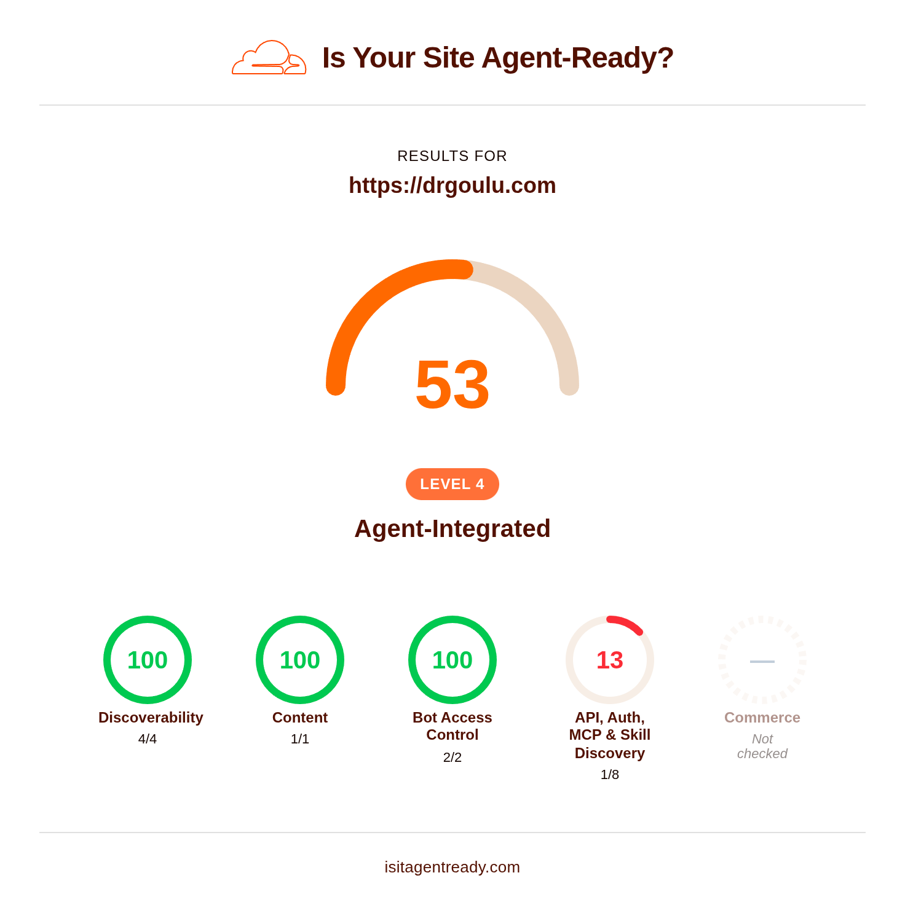

Sur l'ancien drgoulu.com, j'utilisais Google Analytics pour obtenir les statistiques sur l'accès au site. J'aurais pu continuer avec eux, mais

1. je suis dans un processus de deGAFAMisation
2. j'étais intrigué depuis quelques temps par ce petit widget



[Cloudflare](w:) est surtout connu pour ses fonctions de sécurité, mais en investiguant j'ai vu qu'ils proposent bien plus que ça, même avec un compte gratuit.

Ils ont notamment [isitagentready.com](https://isitagentready.com/drgoulu.com), un site qui analyse votre site web pour voir si les agents IA peuvent le lire, voire utiliser l'API du site pour faire des choses...

Dans le cas de drgoulu.com je voulais surtout que les IA des moteurs de recherche trouvent mon contenu puisqu'on voit de plus en plus que les recherches par IA remplacent les recherches "simples".

Pour ça il faut surtout la :

## Markdown Negotiation

Les IA parlent [Markdown](w:). C'est le format de leurs sorties texte, mais aussi de leurs "prompts" d'entrée et de tous les textes qu'elles peuvent lire facilement. Pas le HTML, trop fantaisiste et peu structuré. Du Markdown ou rien.

Donc pour la plupart des sites, il faut un truc qui convertit le HTML d'une page en Markdown pour IA. Sur Wordpress, il y a des plugins comme [LLM Markdown](https://wordpress.org/plugins/llm-markdown/) qui font ça, sinon Cloudflare a un outil [Markdown for agents](https://developers.cloudflare.com/fundamentals/reference/markdown-for-agents/) qui le fait pour n'importe quel site, mais il faut un compte payant...

Mais après avoir [migré sous Hugo](/2026/08/24/migration/), mon contenu est déjà en Markdown ! Simplement il n'est pas sur drgoulu.com mais [sur GitHub](https://github.com/drgoulu/drgoulu.com) ... 

"Il suffit de" dire à Cloudflare d'aller chercher sur GitHub le Markdown correspondant à chaque page HTML sur drgoulu.com. Ca se fait avec un "worker", un petit bout de code que Cloudflare exécute sur toute requête idoine, et voilà :




export default {
  async fetch(request, env, ctx) {
    const url = new URL(request.url);
    const acceptHeader = request.headers.get("Accept") || "";

    // Ne jamais intercepter robots.txt ni les fichiers well-known
    if (url.pathname === "/robots.txt" || url.pathname.startsWith("/.well-known/")) {
      return fetch(request);
    }

    if (acceptHeader.includes("text/markdown")) {
      let cleanPath = url.pathname;
      if (cleanPath.endsWith("/")) cleanPath = cleanPath.slice(0, -1);

      const parts = cleanPath.split("/").filter(Boolean);
      let githubRawUrl;
      if (parts.length >= 4) {
        const year = parts[0];
        const slug = parts.slice(3).join("/");
        githubRawUrl = `https://raw.githubusercontent.com/drgoulu/drgoulu.com/refs/heads/main/content/posts/${year}/${slug}.md`;
      } else {
        githubRawUrl = `https://raw.githubusercontent.com/drgoulu/drgoulu.com/refs/heads/main/content${cleanPath}.md`;
      }

      const githubRes = await fetch(githubRawUrl);
      if (githubRes.ok) {
        const body = await githubRes.text();
        return new Response(body, {
          status: 200,
          headers: {
            "Content-Type": "text/markdown; charset=utf-8",
            "Cache-Control": "public, max-age=3600"
          }
        });
      }
      return new Response("Not found", { status: 404 });
    }

    return fetch(request);
  },
};




c'est gratuit et ça prend moins d'une milliseconde (!!!) par requête:


il y a deux petites astuces :

1. sur github, le contenu est rangé par année alors que sur drgoulu.com il l'est par année/mois/jour. Le worker doit faire une petite conversion
2. il faut faire de petites exceptions, notamment pour le fichier

## robots.txt (avec Content-Signal)

je crois que c'est Google qui avait lancé ça il y a longtemps. C'est un petit fichier texte qui dit aux robots qui indexent le web quoi indexer et comment.

Le mien contient désormais:


User-agent: *
Disallow: /admin/
Content-Signal: ai-train=yes, search=yes, ai-input=yes
Sitemap: {{ "sitemap.xml" | absURL }}


Avec l'arrivée des IA et sur le conseil de [isitagentready](https://isitagentready.com/drgoulu.com), j'ai rajouté la ligne :

`Content-Signal: ai-train=yes, search=yes, ai-input=yes`

C'est elle qui dit aux IA bien élevées [ce qu'elles ont le droit de faire](https://contentsignals.org) avec le contenu du site, ou pas.

J'ai un peu hésité sur `ai-train` qui permet aux IA d'apprendre à partir du contenu du site. Et puis je me suis dit que mon contenu était publié sous licence [Creative Commons](/2013/01/26/acanthapis-petax-cc-et-wikipedia/)  [CC-BY-NC-SA](http://creativecommons.org/licenses/by-nc-sa/3.0/ch/deed.fr), donc que pour autant qu''une IA me cite comme source de temps à autres, elle pouvait apprendre des choses aussi bien que vous ;-)

Je ne me suis évidemment pas fatigué à écrire ce code, c'est 

## l'IA de Cloudflare

qui s'en est chargée. 

 

# 


Implement Link Response Headers
Add Link response headers to your homepage for agent discovery per
RFC 8288 and
RFC 9727 Section 3.
Requirements
Return `Link` headers on your homepage response pointing to machine-readable resources
Use registered relation types: `api-catalog`, `service-desc`, `service-doc`, `describedby`
Example: `Link: </.well-known/api-catalog>; rel="api-catalog"`
Multiple Link headers or comma-separated values are both valid
Cloudflare
Use Transform Rules or
Workers to add Link headers
without modifying your origin server.
Validate
```
POST https://isitagentready.com/api/scan
Content-Type: application/json
{"url": "https://drgoulu.com"}
```
Check that `checks.discoverability.linkHeaders.status` is `"pass"`.

