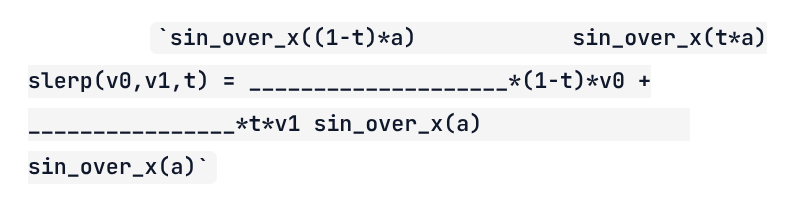
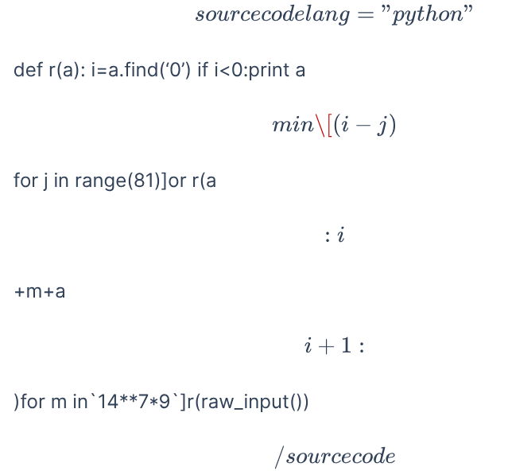

Après plusieurs années de quasi abandon, j'ai décidé de faire revivre ce site pour plusieurs raisons :

1. il tombait en loques et c'était dommage
2. je veux y transférer une bonne partie de l'énorme contenu que j'ai publié [sur Quora](https://fr.quora.com/profile/Dr-Goulu) ces dernières années.
3. j'ai du temps à perdre, et des IA pour m'aider. Les deux se sont révélés indispensables.

## Les problèmes de WordPress

Depuis 2010 ce blog était propulsé par WordPress, qui est devenu un monstre, notamment à cause de la foison de plugins que j'utilisais. Il devenait de plus en plus difficile de gérer les versions, les conflits entre plugins, les mises à jour, et les failles de sécurité, sans compter les bugs de certains, qui ont notamment causé la perte de nombreuses images.

Pourtant, devant l'ampleur de la tâche, j'étais assez réticent à changer de solution. J'ai commencé par copier le site en local sous [LocalWP](https://localwp.com/), ce qui me permettait de farfouiller dans les fichiers sans passer par FTP, et surtout de ne pas abîmer le site en production. J'ai ainsi pu remettre à jour certains plugins indispensables, notamment

* [OpenBook](https://github.com/goulu/openbook) qui a été accepté comme [plugin officiel](https://wordpress.org/plugins/openbook-book-data/) (même si la bannière dit qu'il est obsolète...)
* [Reference 2 Wiki](https://github.com/goulu/reference-2-wiki) pour gérer les milliers de liens vers Wikipédia de drgoulu.com
* [Altmetric](https://github.com/goulu/Altmetric) qui était abandonné
* et le thème [Customizr](https://github.com/goulu/customizr) qui à l'air de l'être car mes "Pull Requests" qui le rendent compatible avec les dernières versions de WP sont ignorées...

Mais même avec tout ça, j'étais encore insatisfait, et attiré par la curiosité : comment faire un blog moderne en 2026 ?

## Les sites "statiques"

La tendance actuelle, est clairement aux [générateur de site statique](w:) : le site est considéré comme un projet informatique qui est "compilé" en pages HTML fixes, "comme dans le temps". Plus de base de données, plus de PHP, plus de failles de sécurité potentielles, et en plus la navigation devient hyper rapide, comme vous vous en apercevez en parcourant ce site...

### Le choix : Hugo

Je suis assez rapidement tombé sur [Hugo](https://gohugo.io/) , mais par acquit de conscience j'ai aussi essayé [Quarto](https://quarto.org/) qui m'a bien tenté pour son orientation scientifique basée sur Python, Jupyter, etc. mais il est surtout utilisé dans le monde académique, et moins pour les blogs généralistes comme le mien.

J'ai aussi examiné [Astro](https://astro.build) , dont la technologie a l'air plus moderne encore, peut-être trop...

Après avoir demandé un [tableau comparatif à une IA](https://share.google/aimode/XGNJvQjEpjzur8hLx), j'ai choisi Hugo dans sa mouture [HugoBlox](https://hugoblox.com), à la fois complète et facile à démarrer.

### Les outils : Git(Hub), VSCode, ...

Pour créer un site, on tape dans un shell :



# Requires Node.js
npm install -g hugoblox
hugoblox create site



et on remplit les champs, et on obtient un dossier de projet avec tout ce qu'il faut dedans.

C'est tout.

Il n'y a plus qu'à écrire des articles en [Markdown](w:), un format de texte enrichi autrefois réservé à de simples fichiers readme.md qui devient très à la mode avec les IA.

A ce moment, il devient très naturel de gérer toutes les modifications apportées au site dans un dépôt git pour être sur de [NE PLUS JAMAIS RIEN PERDRE](/2012/10/31/la-penible-mort-des-donnees/).

Un site peut d'ailleurs être très facilement être [buildé et publié automatiquement sur GitHub pages](https://gohugo.io/host-and-deploy/host-on-github-pages/) à chaque push sur GitHub, mais dans le cas de drgoulu.com , je voulais le conserver chez mon hébergeur (infomaniak). J'ai donc configuré une "action" GitHub qui builde le site et synchronise le dossier /public généré avec infomaniak par [rsync](w:) ssh. Ca prend environ 6 minutes, ce qui est lent mais acceptable quand on publie un article...

### Markdown

Markdown est  l'inconvénient majeur des générateurs de sites statiques , et probablement ce qui limite encore Hugo et ses copains par rapport à WordPress : il n'est pas [wysiwyg](w:). Même si [sa syntaxe](https://www.markdownguide.org) rend le texte plus visuel que du HTML, on ne voit pas le résultat final.

L'approche standard est d'utiliser des plugins de VSCode qui lancent un serveur local et affichent des prévisualisations de la page qu'on édite à chaque "save" de celle-ci

* [Hugo IntelliSense](https://web.archive.org/web/20260826194847/https://marketplace.visualstudio.com/items?itemName=hugoblox.hugo), qui est tout neuf et pas très convaincant pour l'instant
* [Ownable](https://ownable.dev) plus abouti actuellement me semble t'il, mais pas encore top.

Sinon, il existe bien des choses comme [Cloudcannon](https://cloudcannon.com), un éditeur et gestionnaire de site Hugo en ligne via GitHub, que j'utilise pour écrire ces lignes parce qu'il est gratuit pendant 20 jours, mais assez cher ensuite, ce qui fait que je ne vais pas le garder, hélas. De plus il fait un rendu un peu intermédiaire, certaines choses étant wysiwyg et d'autres pas. 

### Les Shortcodes

La difficulté tient aux "shortcodes" qui permettent d'étendre Markdown pour afficher du code formaté, des videos YouTube etc.

Hugo en [supporte déjà pas mal et par défaut](https://gohugo.io/shortcodes/) permet d'en définir très facilement en [écrivant un simple fichier "template"](https://gohugo.io/templates/shortcode/). Je l'ai fait notamment pour:

- [openbook4hugo](https://github.com/drgoulu/openbook4hugo), un simple portage du [openbook data plugin](https://github.com/goulu/openbook) pour WordPress que je m'étais fatigué à maintenir tellement il m'était indispensable, utilisé dans une multitude d'articles pour afficher des références et des couvertures de livres
- [altmetric4hugo](https://github.com/drgoulu/altmetric4hugo), un portage de [Altmetric WordPress Plugin](https://github.com/goulu/Altmetric) qui décore les références d'articles scientifiques

Mais avec ça, impossible d'obtenir un rendu "wysiwyg" sans passer par une compilation Hugo...

### Sveltia 

C'est en cherchant une solution à ceci que je suis tombé sur [sveltia-cms](https://github.com/sveltia/sveltia-cms). Comme l'indique son nom, l'ambition de ce projet open source est de réaliser un "content management system" complet, mais l'éditeur de markdown me semblait proche de ce dont j'avais besoin.

Le petit wrapper [headless-cms](https://github.com/drgoulu/headless-cms) permet d'intégrer Sveltia comme un module Hugo, et de faire l'interface, notamment en ajoutant un bouton "edit" aux articles, visible uniquement si on est authentifié avec droit d'écriture sur le projet GitHub. (donc moi uniquement...)

Après quelques échanges avec l'auteur principal de sveltia-cms, j'ai constaté que nous objectifs étaient assez différents, donc je me suis résolu à maintenir [mon propre fork de sveltia](https://github.com/drgoulu/sveltia-cms) que j'ai complété notamment avec :

- Le support des shortcodes utilisés sur drgoulu.com
- La gestion de la structure des dossiers d'articles, organisés par année
- L'intégration du moteur de recherche interne dans la boite de création des liens
- et surtout, la ...

#### Prévisualisation en (quasi) temps réel

Il faut l'admettre, la possibilité d'éditer des articles sur le site lui-même est un peu contradictoire avec la notion de "site statique", car il faut alors un serveur plus sophistiqué qu'un simple serveur web de pages statiques.

Le cycle de compilation normal du site suite à un commit+push de nouveau contenu sur GitHub mentionné plus haut est beaucoup trop lent, puisqu'il prend environ 6 minutes.

Il faut donc un serveur spécifique, en l'occurrence on utilise le serveur de développement de hugo qui permet une compilation simplifiée en 5 à 6 secondes seulement.

J'envisage installer ceci sur Infomaniak un de ces jours, mais pour l'instant je ne l'utilise que pour la rédaction des articles en local.

## LA MIGRATION

L'exportation du contenu de l'ancien drgoulu.com s'est passée sans difficulté grâce à [wordpress-to-hugo-exporter](https://github.com/SchumacherFM/wordpress-to-hugo-exporter). 

Les problèmes sont apparus après car mon vieux site était quand même bien abîmé .

### IA = Indispensable Assistant

Franchement, sans l'IA (Gemini) intégrée dans Antigravity (l'IDE que j'utilise de préférence à VSCode), j'aurais abandonné.

Elle a permis de faire des dizaines de recherches/remplacements qui m'auraient pris de heures à la main ou à écrire les regex en quelques minutes.

Le plus incroyable s'est produit lorsque je lui ai demandé de retrouver des images qui avaient disparu car je les avais "hotlinké" sans m'en rendre compte, et que le site d'origine avait bien entendu changé ou disparu. L'IA a pensé "toute seule" à les chercher sur l' [Internet Wayback Machine](https://web.archive.org/web/20260000000000*/drgoulu.com) qui conserve les anciennes versions de pratiquement tout internet ! Et les a toutes retrouvées, téléchargées dans le site Hugo, et insérées proprement dans les articles. Wow. En quelques minutes !

> dans [2007-10-11-la-bonne-maniere-de-calculer-des-trucs](dans%202007-10-11-la-bonne-maniere-de-calculer-des-trucs).md, transforme en latex les deux équations sur la fonction slerp qui sont écrites en texte, en t'appuyant sur la wayback machine

a transformé ça :

en ça :

$$\text{slerp}(v_0, v_1, t) = \frac{\text{sin_over_x}((1-t)a)}{\text{sin_over_x}(a)} (1-t) v_0 + \frac{\text{sin_over_x}(ta)}{\text{sin_over_x}(a)} t v_1$$

et

> reformate le contenu de tous les shortcodes highlight en reproduisant celui trouvé dans la wayback machine

a transformé ça :

en ça :



def r(a): i=a.find('0') if i<0:print a [m in[(i-j)%9*(i/9^j/9)*(i/27^j/27|i%9/3^j%9/3)or a[j]for j in range(81)]or r(a[:i]+m+a[i+1:])for m in`14**7*9`]r(raw_input())



(mauvais exemple car le code est sur une seule ligne...)

### Commentaires Disqus

Un aspect de drgoulu.com auquel je tiens a aussi été rendu difficile par le passage é Hugo : les commentaires.

J'ai du revenir à [Disqus](https://disqus.com/). J'avais utilisé cette solution commericale pendant un temps, puis abandonnée pour revenir aux commentaires natifs de WordPress.

Je n'ai pas beaucoup hésité :  il n'y a pas vraiment d'alternative et une bonne partie des commentaires y étaient déjà, donc j'ai installé, et un peu ramé...

Il y a notamment eu un problème un peu technique que j'ai remonté au support Disqus, il est documenté dans un commentaire ci-dessous, que je supprimerai quand il sera résolu.

Et je cherche toujours quelques années de commentaires WordPress qui n'ont pas migré sous Disqus pour une raison inconnue ...

(Edit du 8.10 : trouvé ! Le fichier .xml exporté je venait pas de drgoulu.com mais de drgoulu.local, ma copie locale de développement. Or Disqus raccroche les commentaires aux URL exactes des articles... Un petit search/replace dans le xml plus tard, tout est rentré dans l'ordre)

Le gros morceau qui reste, c'est mon projet de [migrer mes milliers de réponses Quora ici... J'y consacre un article séparé.](/2026/09/17/2026/migration-de-quora-à-hugo/)

## Références:

- [Migration de Wordpress vers Hugo](https://www.hleroy.com/2022/09/migration-de-wordpress-vers-hugo/), article de blog duquel j'ai copié l'image d'entête
