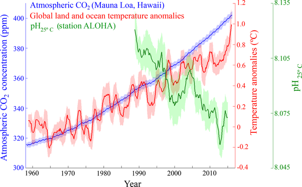

*Réponse publiée [sur Quora](https://fr.quora.com/Pourquoi-la-terre-se-r%C3%A9chauffe-t-elle-plus-rapidement-quil-y-a-200-ans/answer/Dr-Goulu)*

Diagramme présentant les concentrations mensuelles de CO₂ atmosphérique (ppm) (bleu) mesurées à l'observatoire de Mauna Loa, à Hawaï ([http://www.esrl.noaa.gov/gmd/ccg...](http://www.esrl.noaa.gov/gmd/ccgg/trends/data.html), consulté le 6 septembre 2018) ; les anomalies mensuelles de température de l'air et de la surface de la mer (°C) à l'échelle mondiale ([http://data.giss.nasa.gov/gistemp/](https://web.archive.org/web/20260602195142/http://data.giss.nasa.gov/gistemp/), consulté le 6 septembre 2018) ; et le pH (vert) mesuré à la station ALOHA, dans le Pacifique Nord central ([http://hahana.soest.hawaii.edu/h...](https://web.archive.org/web/20260428075758/http://hahana.soest.hawaii.edu/hot/products/HOT_surface_CO2.txt)). Les valeurs représentent des moyennes mobiles sur 12 mois et la zone ombrée indique l'écart type sur 12 mois.
