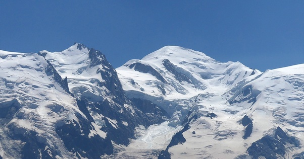

---

title: Pourquoi les Français continuent-ils de l'appeler Mont Blanc, une appellation qui peut être perçue comme raciste ? La montagne est manifestement plus colorée, alors pourquoi ne pas l'appeler Mont Couleur ?
slug: pourquoi-les-francais-continuent-ils-de-l-appeler-mont-blanc-une-appellation-qui-peut-etre-percue-comme-raciste-la-montagne-est-manifestement-plus-coloree-alors-pourquoi-ne-pas-l-appeler-mont-couleur
date: '2026-05-08'
draft: true
categories:
- Pourquoi
tags: []
coverImage: ./images/qimg-4ee07f822ea96be167c5edf806e262c4.jpg
---

*Réponse publiée [sur Quora](https://fr.quora.com/Pourquoi-les-Fran%C3%A7ais-continuent-ils-de-l-appeler-Mont-Blanc-une-appellation-qui-peut-%C3%AAtre-per%C3%A7ue-comme-raciste-La-montagne-est-manifestement-plus-color%C3%A9e-alors-pourquoi-ne-pas-l-appeler/answer/Dr-Goulu)*

Vous avez déjà vu le Mont Blanc ?

Il est blanc comme neige, toute l'année.

Couvert d'or blanc.

En maa, le Kilimandjaro s'appelle *Ol Doinyo Oibor* ce qui signifie "Montagne blanche".

Mont blanc aussi…
