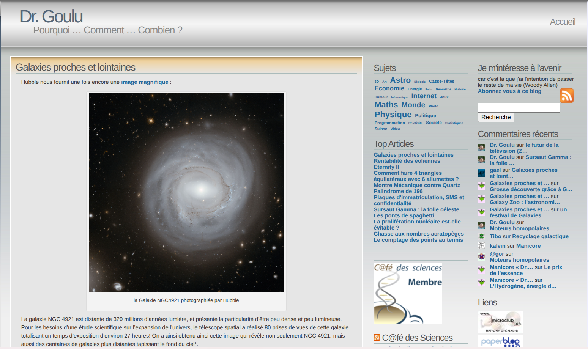

La plaie quand on a un "vieux" site, ce sont les liens cassés : pages modifiées, effacées, redirigées n fois, sites complets disparus ou pire, repris par des casinos en ligne ... 

Sur drgoulu..com, il y a plus de 3500 liens qui ne mènent plus au bon endroit. Sur mon ancien site Wordpress, j'avais un plugin qui m'informait chaque semaine de nouveaux liens cassés, ce qui me faisait une belle jambe....

Et puis, lors de la [migration de Wordpress à Hugo](/2026/08/24/migration/), c'est l'IA qui été chercher "toute seule" des images manquantes sur [Internet Archive](w:), plus particulièrement sur la [Wayback Machine](w;), l'incroyable site qui archive les versions passées de beaucoup de pages internet.

Par exemple en cherchant "drgoulu.com" sur [https://web.archive.org](https://web.archive.org), on peut retrouver:

Et ça m'a donné la lumineuse idée\* de l'utiliser pour restaurer les liens cassés !

## archive_broken_links.py

Un petit coup de vibe coding plus tard, j'ai un [script archive_broken_links.py](https://github.com/drgoulu/drgoulu.com/blob/main/scripts/archive_broken_links.py) qui teste tous les liens du site, les corrige s'il y a redirection, et va les chercher à la bonne date s'ils sont cassés. 

Un quart d'heure plus tard, ça n'a pas corrigé tous les problèmes, mais beaucoup :



Articles analysés        : 18255
Articles modifiés        : 1895
Liens remplacés          : 3252
    - Instantanés antérieurs confirmés : 1335
    - Sans capture antérieure trouvée  : 2045



Là encore c'était faisable sans IA, et peut être sous WordPress, mais beaucoup, beaucoup plus compliqué

## donotlink.it

La Wayback Machine remplit désormais aussi une autre fonction sur drgoulu : lier les sites que je ne voulais pas référencer.

Pour illustrer certains articles sur les pseudo sciences, je voulais faire des liens mais sans permettre aux sites visés de se prévaloir d'une référence de ma part, qui aurait fait monter leur score sur Google. J'ai donc utilisé le site [donotlink.it](https://web.archive.org/web/20201101112122/https://donotlink.it/) qui faisait ça, mais qui a disparu.

Je découvre grâce à la Wayback Machine que son [code est sur GitHub](https://github.com/connyduck/donotlink), mais je n'ai pas l'intention de ressusciter ce site désormais peu utile.

Car la Wayback Machine remplit exactement le même rôle ! Un lien vers une page archivée ne rapporte plus lien à son auteur. : ses bêtises sont archivées pour longtemps sans rien lui rapporter.

Et c'est peut-être la plus grave menace qui pèse sur le fantastique outil qu'est la Wayback Machine : qu'un [sombre idiot veuille effacer ses traces](https://edition.cnn.com/2025/02/18/tech/internet-archives-deleted-websites-wayback-machine)...

Note \* vous avez remarqué ? Quand l'IA a fait ça j'ai juste dit qu'elle l'avait fait, comme si c'était normal. Alors que quand c'est moi qui l'ai fait, c'était une lumineuse idée...
