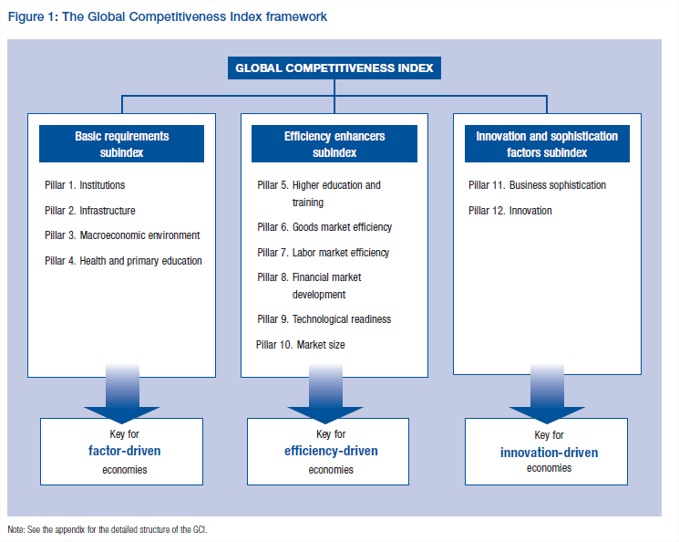

Tombé sur le "[Global Competitiveness Report 2012–2013](http://www3.weforum.org/docs/WEF_GlobalCompetitivenessReport_2012-13.pdf)" du World Economic Forum, je n'en aurais pas eu beaucoup plus à dire que dans [cet article sur les classements](http://drgoulu.local/2009/05/21/unites-et-classements/) (d'autant qu'ici la Suisse est classée 1ère...) si je n'étais pas tombé page 8 sur cette figure qui résume la construction de l'index de compétitivité :

Je trouve intéressant de distinguer ces 3 familles de critères et de se demander si un pays va bien grâce à des facteurs politico-économiques de base, une économie efficace, ou une innovation dynamique.

Les rangs de chaque pays (pages 14+15) selon ces 3 aspects sont souvent proches, mais les écarts sont instructifs. Ainsi les Etats-Unis sont à la 7ème place du classement principalement en raison de leur 33ème position aux facteurs de base alors qu'ils sont 2èmes en efficacité et 7èmes en innovation. Singapour (2ème) et Hong-Kong (9ème) sont respectivement 1er et 3ème pour les critères de base et l'efficacité, mais moins bons (11ème et 22ème) que la Suisse en innovation.
