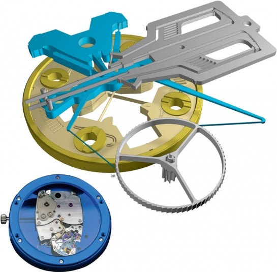

Le brevet est là : http://www.google.com/patents/EP1736838A1?cl=fr et les explications les plus détaillées que j'ai pu trouver ici : http://www.horlogerie-suisse.com/horlomag/articles-horlogers/00232/un-nouvel-echappement-dans-un-mouvement-avec-une-reserve-de-marche-de-30-jours En passant, il remplace le spiral par deux lames flexibles (visibles à 2:20 sur la vidéo  ), ce qui modifie passablement les calculs de http://drgoulu.local/2005/12/12/calcul-dun-ressort-spiral-dhorlogerie/ :-)
