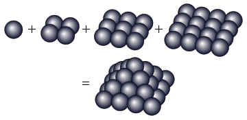



Ces temps je vois des "courbes elliptiques" partout : dans la démonstration du théorème de Fermat, en cryptographie, jusque dans le 4ème tome de la saga Millénium [[1]](#ref-1). Mais qu'est-ce donc que ces choses là ?

## Des courbes somme toute assez simples

La page Wikipédia "[courbe elliptique](https://fr.wikipedia.org/wiki/courbe_elliptique)" étant un peu touffue en première approche, j'ai trouvé des informations plus abordables sur les pages d'introduction [[2]](#ref-2), [[4]](#ref-4) de deux sites traitant de cryptographie.

Une courbe elliptique est une courbe plane d'équation \[mathjax\] $$y^2 = x^3 + a.x + b$$, où les paramètres a et b doivent être tels que $$4a^3+27b^2 \neq 0$$ pour une raison que l'on peut deviner en regardant le tracé obtenu pour différentes valeurs de a et b:



Certaines valeurs de (a,b) créent des [singularités](https://fr.wikipedia.org/wiki/Singularité_(mathématiques)) : par exemple pour a=b=0, on voit ci-dessus que la courbe définie par $$y^2 = x^3$$ a un "point de rebroussement" à l'origine, mais il y a d'autres singularités au moment où la "goutte" est reliée par un seul point (double) au reste de la courbe, où au moment ou la goutte se réduit à un seul point. Tous ces cas sont éliminés par la condition $$4a^3+27b^2 \neq 0$$.

## Des courbes étonnamment utiles

La page [[4]](#ref-4) montre par un joli exemple l'utilité des courbes elliptiques. Imaginez que votre sergent-chef vous ordonne de faire une pyramide de boulets de canon comme ci-contre, mais exige aussi que vous fassiez un carré parfait avec le même nombre de boulets à côté. Evidemment vous faites comme moi : vous posez un seul boulet pour faire une pyramide d'un seul étage, et un autre boulet à côté pour faire un carré de 1x1. Et là il se met à vous hurler dessus en vous traitant de feignant (alors que vous avez fait un effort pour ne pas proposer la solution 0=0 ....) et vous ordonne de trouver une autre solution.

Oui mais y'en-a-t'il une ? Avant de vous casser le dos à perpétuité vous écrivez rapidement l'équation du problème :

le nombre de boulets est égal à $$1+4+9+16+...+x^2 = \frac{x(x+1)(2x+1)}{6}$$ où x est le nombre de couches de la pyramide et il doit être égal à $$y^2$$ où y  est le côté du carré de boulets. Donc on cherche les nombres entiers x et y tels que : $$\frac{x(x+1)(2x+1)}{6}=y^2$$, soit $$2x^3+3x^2+x=6y^2$$ . Cette [équation diophantienne](https://fr.wikipedia.org/wiki/équation_diophantienne) n'a pas tout à fait la forme d'une courbe elliptique, mais presque.



 

https://en.wikipedia.org/wiki/Elliptic\_curve\_primality

https://cp4space.wordpress.com/2012/08/29/elliptic-curve-calculator/

 

https://www.grahamcluley.com/2013/09/nsa-cheated-cryptography/

### Références

1. 
2. "La cryptographie expliquée : [Les courbes elliptiques](http://www.bibmath.net/crypto/index.php?action=affiche&quoi=complements/courbelliptique)" sur Bibm@ath
3. "La cryptographie expliquée : [Chiffrer à l'aide des courbes elliptiques](http://www.bibmath.net/crypto/index.php?action=affiche&quoi=complements/cryptoelliptique)" sur Bibm@ath
4. Jeremy Kun "[Elliptic Curves as Elementary Equations](http://jeremykun.com/2014/02/10/elliptic-curves-as-elementary-equations/)", 2014
5. Jeremy Kun "[Elliptic Curves as Algebraic Structures](http://jeremykun.com/2014/02/16/elliptic-curves-as-algebraic-structures/)", 2014
6. Jeremy Kun "[Elliptic Curve Diffie-Hellman](http://jeremykun.com/2014/03/31/elliptic-curve-diffie-hellman/)", 2014
7. Jeremy Kun "[Elliptic Curves as Python Objects](http://jeremykun.com/2014/02/24/elliptic-curves-as-python-objects/)", 2014
8. Brown, E. (2000). "[Three Fermat Trails to Elliptic Curves](http://www.maa.org/sites/default/files/pdf/upload_library/22/Polya/07468342.di020792.02p05747.pdf)". The College Mathematics Journal, 31, 162–172. Retrieved from
