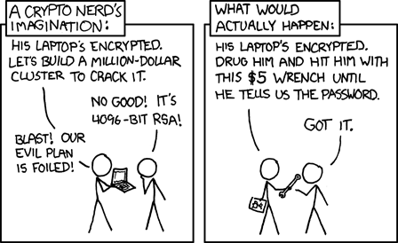

Je me suis fait avoir comme un débutant (que je suis). J'ai reçu un e-mail très courtois m'invitant à participer à [une étude décrite ainsi](https://userstudies.cs.uni-saarland.de/pythonstudy-explanation/) :

> Ceci est une étude conduite conjointement par des chercheurs en informatique de l'Université du Maryland (USA) et de l'Université du Saarland (Allemagne). Le but de l'étude est d'en apprendre plus sur la façon de penser des développeurs de logiciels et comment ils prennent des décisions lorsqu'ils écrivent du code en Python. Nous espérons que les résultats aideront à améliorer Python pour tous.

Ca avait l'air sympa et pour la bonne cause, et en plus on pouvait coder rapidement les solutions et les tester directement dans un IDE en ligne genre [PythonAnywhere](https://www.pythonanywhere.com/), alors j'ai donné vite fait mes solutions à 3 petits problèmes de programmation:

1. Le premier consistait à écrire une fonction qui stocke des paires de username/password dans une base de données sqlite. Ca aurait du me mettre la puce à l'oreille parce que je ne trouvais pas ça très intéressant, mais j'ai juste copié le tutoriel de la [librairie sqlite3](https://docs.python.org/3.6/library/sqlite3.html) pour implanter ça en 2 minutes chrono.
2. Le second consistait à écrire deux fonctions encryptant et décryptant respectivement une chaîne de caractères. Là je me suis dit que le test portait probablement sur l'utilisations de librairies standard. En listant les librairies installées dans l'environnement python mis à disposition, j'ai remarqué la librairie [cryptography](https://pypi.python.org/pypi/cryptography), que je n'ai jamais utilisée mais qui permet de résoudre le problème aussi en quelques lignes. 2 autres minutes chrono.
3. Le troisième était plus intéressant. Il s'agissait d'écrire un raccourcisseur d'URL genre https://bit.ly/ , mais en fait seule la fonction générant l'URL raccourcie était demandée. Là j'ai commencé par utiliser la fonction [hash standard](https://docs.python.org/3.6/library/functions.html#hash) pour obtenir un nombre correspondant à l'URL long, et le représenter en [base 36](https://fr.wikipedia.org/wiki/base_36) pour en faire un URL court à l'aide de ma fonction [str\_base](http://goulib.readthedocs.io/en/latest/modules/Goulib.math2.html#Goulib.math2.str_base) puisque [base\_repr de numpy](https://docs.scipy.org/doc/numpy-1.10.1/reference/generated/numpy.base_repr.html) n'était pas disponible. Mais ayant remarqué que ceci produit des URL courts de 10 caractères, je me suis rabattu sur un simple compteur : l'URL court est la représentation base 36 de l'index de l'URL long dans la base de données, et c'est tout. Simple, efficace, rapide...

Sauf qu'après avoir testé et soumis mon code vite fait bien fait, il y avait une deuxième étape à l'étude : le questionnaire.

Pour chacune des questions ci-dessus, il fallait qualifier 3 affirmations :

- "la tâche a été difficile". J'ai répondu "strongly disagree" pour les 3 : quelques lignes de code sans difficulté particulière, en toute modestie...
- "je suis confiant que ma solution est correcte". Comme un bug est toujours possible surtout, j'ai répondu "agree" plutôt que "strongly agree".
- "je suis confiant que ma solution est sûre". Comme il n'y avait pas de réponse "AAArrrrgh ! Enfer et damnation je me roule par terre de honte en implorant la pitié et le pardon de mes collègues de la terre entière", j'ai du juste mettre "strongly disagree".

Voilà. Si vous comprenez pourquoi, essayez de me pardonner et veuillez ne pas lire la suite pour ne pas remuer le couteau dans la plaie.

Sinon, c'est pour vous que j'ai écrit ce mea culpa. En fait cette étude n'étudie pas Python comme elle le prétend, mais la sensibilité "naturelle" des programmeurs à la sécurité informatique, lorsqu'ils ne sont pas conscients d'écrire une application sensible nécessitant des précautions particulières.

Et les chercheurs enfoncent le clou en posant quelques questions supplémentaires pour chaque problème:

- Qu'est-ce qui rend votre solution sure ou vulnérable ?
- Quand vous avez effectué cette tâche, avez-vous pensé à la sécurité ou la protection des données ("privacy") ? A quoi spécifiquement ?
- Aviez-vous déjà écrit du code similaire précédemment ?

Alors voilà ce que je me suis vu contraint de répondre pour les trois problèmes:

1. Mon code contrevient à une règle de sécurité élémentaire : ne jamais stocker un mot de passe en clair. Si un pirate parvient à accéder à la base de données, il obtient les username+password de tous les utilisateurs. L'horreur.
