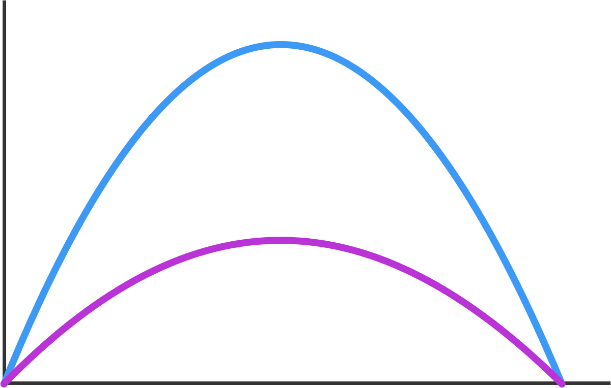

Tombé par hasard sur [Brilliant.org](https://brilliant.org/) , un site pour apprendre plein de choses en s'amusant à résoudre des casse-tête sur toutes sortes de sujets. Il est en anglais, mais très accessible.



Parmi de nombreuses activités, une liste de problèmes de difficulté croissante est proposée chaque semaine. Le plus simple de cette semaine est celui ci-contre, pour vous faire une idée. Je le trouve bien car il demande de commencer par bien observer...

Le premier tiers des problèmes est accessible aux enfants, comme celui-ci, testé sur une jeune fille de 10 ans (avec un peu d'aide...)  : trouver le chiffre de 1 à 9 à écrire à la place de tous les points pour que la somme ait 5 chiffres, et écrire cette somme :

\[latex\]\\begin{array} { rrrrr } & & & & & . \\\\ & & & & . & . \\\\ & & & . & . & . \\\\ + & & . & . & . & . \\\\ \\hline & \\\_ & \\\_ & \\\_ & \\\_ & \\\_\\\\ \\end{array}\[/latex\]

Le premier qui m'a demandé quelques calculs est [celui-ci](https://brilliant.org/weekly-problems/2017-05-15/intermediate/?p=5), que j'aime bien d'une part en tant qu'[ex artilleur](/2010/01/16/histoire-dangles/), et d'autre part parce que je ne me souviens pas qu'un [professeur de physique](/2016/09/11/solutions-admissibles/) ou un film d'action m'ait épaté avec cette possibilité physique: on peut tirer successivement deux projectiles à la même vitesse initiale v de manière à ce qu'ils arrivent au même point au même instant.

La figure ci-contre met sur la voie ceux qui pensent que ce n'est pas possible : en tirant un premier pruneau avec une grande [élévation](https://fr.wikipedia.org/wiki/élévation_(balistique)) sur une [trajectoire parabolique](https://fr.wikipedia.org/wiki/trajectoire_parabolique) en cloche qui va prendre un certain temps, puis un second sur une trajectoire tendue, qui va prendre un temps plus court.

Le problème posé est de déterminer le point d'impact, la vitesse initiale v et l'intervalle de temps \[latex\]\\Delta t\[/latex\] étant donnés. J'ai utilisé le fabuleux [Wolfram Alpha](https://www.wolframalpha.com/)  pour jongler avec les équations \[latex\]t = \\frac{2v}g\\sin(\\theta)\[/latex\] qui donne la durée de vol et \[latex\]d = \\frac{2v^2}g \\sin(\\theta) \\cos(\\theta)\[/latex\] qui donne la distance de tir, mais à la fin j'ai obtenu la jolie formule \[latex\]d = \\frac{v^2}g - \\frac{g(\\Delta t)^2}4\[/latex\] qui permet de trouver la solution.

Mais comme j'avais fait une stupide erreur dans mes calculs trop compliqués (2  au dénominateur de la 2ème fraction...), ma solution était fausse, et j'ai eu recours au bouton "Discuss solutions" pour voir la bonne, ma faute, et une méthode bien plus courte pour obtenir la jolie formule. "Je ne perds jamais, soit je gagne, sois j'apprends", comme disait Mandela, et c'est bien l'esprit de "Brilliant.org".

Après ce dernier problème de la catégorie "intermediate" qui devrait convenir aux lycéens, on attaque les problèmes "advanced", et là ... c'est dur.
