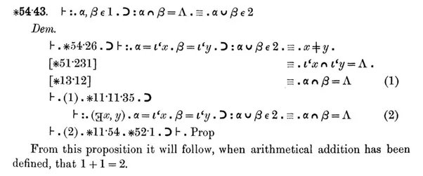

*Réponse publiée [sur Quora](https://fr.quora.com/Y-a-t-il-une-question-mathématique-qui-semble-facile-mais-est-difficile-en-réalité/answer/Karen-Kamidian)*

Et bien vous êtes très forts, parce que 1+1=2 n'a été prouvé par la logique formelle que vers 1900 par Whitehead et Russell dans les [Principia Mathematica](w:) :

