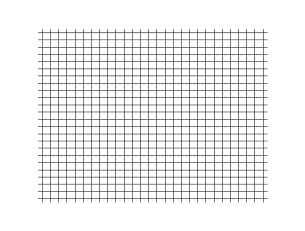

*Réponse publiée [sur Quora](https://fr.quora.com/Je-dispose-dune-tige-extrêmement-longue-et-dune-rigidité-parfaite-je-pousse-la-tige-dun-coté-lautre-coté-se-déplacera-lui-aussi-immédiatement-Aucune-compression-Une-information-irais/answer/Dr-Goulu)*

non, ça comprimerait la tige, c’est tout. (car rien n’est infiniment rigide…)

Le mouvement se propage comme une [une onde longitudinale](w:Onde_longitudinale)(sauf que le dessin ci-dessous correspondrait plutôt à un impact à gauche. Avec un mouvement, le matériau ne se distendrait pas après le passage de l’onde, mais il y aura un petit mouvement final à droite.

