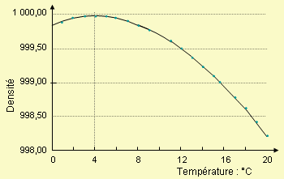

*Réponse publiée [sur Quora](https://fr.quora.com/Le-réchauffement-climatique-fait-fondre-la-banquise-au-Pole-Nord-Mais-comment-fait-il-pour-agrandir-la-banquise-au-Pole-Sud-pour-le-lien-si-vous-pouvez-regardez-plutôt-dans-Google-Earth/answer/Dr-Goulu)*

Bien sur que l'eau se dilate avec la température ! Yaka voir sa densité :

Deux pour mille à 20 degrés ça fait deux mètres pour mille mètres d'eau…
