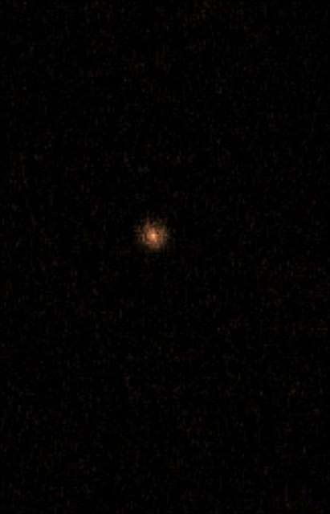

*Article initialement publié sur [Quora](https://fr.quora.com/Pourquoi-les-atomes-vue-au-microscope-ressemblent-ils-%C3%A0-des-%C3%A9toiles-Je-ne-fais-pas-r%C3%A9f%C3%A9rence-au-mod%C3%A8le-de-Bohr/answer/Dr-Goulu)*

Vous voulez dire celle-là :

(source [Atome isolé : une photo des plus spectaculaires !](https://www.futura-sciences.com/sciences/actualites/atome-atome-isole-photo-plus-spectaculaires-25431/) )

L’explication est dans la légende de l’image :

> Lorsqu'il est éclairé par un laser de couleur bleue-violette, l'ion de strontium piégé dans l'expérience absorbe et réémet des photons rapidement. Avec un appareil photo ordinaire, une pause longue accumule ces grains de lumière en observant à travers une fenêtre de la chambre à ultra-vide qui abrite le piège à ions. La petite tache colorée qui apparaît alors ne montre bien sûr pas la taille de l'atome mais elle signale spectaculairement sa présence.

Donc la “photo” est en fait la superposition de nombreuses images dans lesquelles l’atome a envoyé un photon sur un des pixels de la caméra.

C’est en effet similaire à une photo astronomique où l’atmosphère disperse un peu la lumière. Le point commun est que la source est plus petite qu’un pixel …
