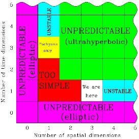

*Article initialement publié sur [Quora](https://fr.quora.com/%C3%80-quoi-ressembleraient-les-hommes-sils-%C3%A9taient-en-4-dimensions/answer/Dr-Goulu)*

Ils ne ressembleraient pas à des hommes, ni à rien de connu tant la physique, la chimie et la biologie seraient différentes, si tant est qu'elles puissent exister.

Car avec 4 dimensions spatiales et une de temps, les équations de champ n'ont pas de solutions stables : aucune hyperplanète ne peut orbiter un hypersoleil. Et si cet univers a plus d'une dimension temporelle alors les équations deviennent “ultra hyperboliques” et il devient impossible d'effectuer une prédiction dans cet univers. Et des lors l'intelligence n'est pas un avantage évolutif.

[Pourquoi 3 dimensions + 1 temps ? - Pourquoi Comment Combien](/2011/01/30/pourquoi-3-dimensions-1-temps/)
