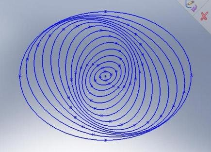

*Article initialement publié sur [Quora](https://fr.quora.com/Les-trous-noirs-tournent-rapidement-sur-eux-m%C3%AAmes-mais-dans-quel-sens-pourraient-ils-%C3%AAtre-une-sorte-de-pivot-des-galaxies-spiral%C3%A9es-Quelle-est-la-diff%C3%A9rence-entre-la-force-centrifuge-ou/answer/Dr-Goulu)*

ça fait trois questions ;-)

1. le sens de rotation de quelque chose dépend de la direction dans laquelle vous l’observez. Il n’y a pas de gauche et de droite dans l’espace (sauf à très petite échelle, dans des cas très particuliers[[1]](#wQIPK) ). Mais si c’était votre question, les trous noirs supermassifs tournent en général dans le même sens que leur galaxie hôte. Je dis “en général” car la fusion de galaxies pourrait produire des exceptions[[2]](#PLGbr) .
2. Non. les trous noirs supermassifs ne font que quelques millions de masses solaires (MMS), alors qu’une galaxie a typiquement un masse de centaines de milliards de masses solaires (GMS). Par exemple la Voie Lactée a une masse de 600 GMS, alors que [Sagittaire A*](w:) ne pèse que 4.3 MMS, 100′000 fois moins. Les trous noirs centraux n’ont qu’un effet gravitationnel assez local au centre de la galaxie, mais il semble qu’ils favorisent la formation d’étoiles dans ces régions[[3]](#dZxVl) et que leurs jets contribuent à “recycler” la matière à grande distance[[4]](#DgZhz) .
Dans les galaxies spirales, les étoiles ne descendent pas en spirale vers le centre mais tournent globalement sur des “ellipses d’axes décalés”, les bras apparaissant alors comme des “ondes de pression”[[5]](#unOnT) . Paradoxalement, les bras d’une galaxie spirale ne tournent pas :

- 3. la force centripète est créée (dans le modèle Newtonien) par la gravitation de tous les autres astres, dont le centre de gravité est grosso-modo au centre de la galaxie. En relativité, il n’y a pas de force centripète : les astres sont en chute libre dans un espace déformé par les masses.

En passant, la rotation extraordinairement rapide des trous noirs est un sujet passionnant : [A combien tourne un trou noir ? - Pourquoi Comment Combien](https://www.drgoulu.com/2016/07/10/combien-tourne-un-trou-noir/)

Notes de bas de page

[[1]](#cite-wQIPK)[MIROIR | ЯIOЯIM - Pourquoi Comment Combien](https://www.drgoulu.com/2009/04/04/miroir/)

[[2]](#cite-PLGbr)[Coupling between galaxy spin and central black hole spin](https://physics.stackexchange.com/questions/222415/coupling-between-galaxy-spin-and-central-black-hole-spin)

[[3]](#cite-dZxVl)[Les trous noirs : des moteurs de l'Univers ? - Pourquoi Comment Combien](https://www.drgoulu.com/2008/09/06/les-trous-noirs-des-moteurs-de-lunivers/)

[[4]](#cite-DgZhz)[Recyclage galactique - Pourquoi Comment Combien](https://www.drgoulu.com/2009/02/04/recyclage-galactique/)

[[5]](#cite-unOnT)[Simulation de Galaxie Spirale - Pourquoi Comment Combien](https://www.drgoulu.com/2007/08/23/simulation-de-galaxie-spirale/)
