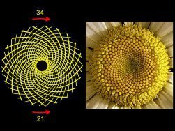

*Article initialement publié sur [Quora](https://fr.quora.com/O%C3%B9-dans-la-nature-peut-on-trouver-une-s%C3%A9quence-de-Fibonacci/answer/Dr-Goulu)*

On en trouve deux termes consecutifs en [phyllotaxie](http://www.wikipedia.org/search-redirect.php?language=fr&go=Go&search=phyllotaxie) : des graines de tournesol aux pommes de pin, beaucoup de structures botaniques croissent en faisant de jolies spirales apparentes, les “parastiches”. Certaines tournent dans un sens et s’entrecroisent avec d’autres orientées en sens inverse, et le nombre de parastiches dans chaque sens correspond toujours à deux termes consécutifs de la suite de Fibonacci.

Mais les plantes ne comptent pas : ces structures sont le résultat d'une optimisation qui se produit aussi avec des processus physiques :

[https://youtu.be/9Qy8QnNqB4A](https://youtu.be/9Qy8QnNqB4A)

Plus de détails sur [Nombre d'or et abeilles - Pourquoi Comment Combien](/2016/07/03/nombre-dor-et-abeilles/#.XJXxchnjKyU)
