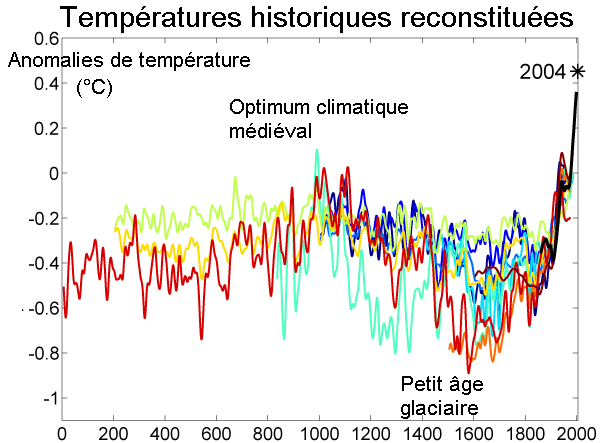

*Article initialement publié sur [Quora](https://fr.quora.com/Est-ce-que-nous-allons-vivre-des-heures-sombres-pour-lavenir-de-notre-esp%C3%A8ce-avec-le-grand-minimum-solaire-qui-samorce/answer/Dr-Goulu)*

Non.

Le [Petit Âge glaciaire](w:) a coïncidé avec le [Minimum de Maunder](w:), mais il semblerait que de grosses éruptions volcaniques aient contribué à un refroidissement total et temporaire de 0.6° C

Un phénomène similaire aujourd’hui serait plutôt bienvenu, à part les volcans, mais ne compensera pas le réchauffement anthropique.

Autre source : [Activité solaire au plus bas : quel impact sur le climat?](https://www.rts.ch/meteo/10006698-activite-solaire-au-plus-bas-quel-impact-sur-le-climat-.html)
