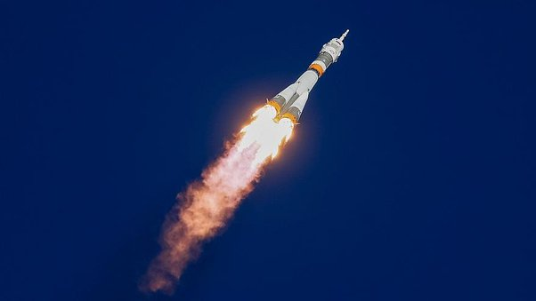

*Article initialement publié sur [Quora](https://fr.quora.com/Est-il-possible-de-br%C3%BBler-de-leau/answer/Dr-Goulu)*

Non, l’eau est déjà de la “cendre” d’hydrogène brûlé.

Le [Feu](w:) est une réaction d’oxydation en présence d’oxygène. Avec de l’hydrogène ça donne 2H2 + O2 => 2 H2O sous forme de vapeur à haute pression, très utile :

( illustration de [ma réponse à Les scientifiques peuvent-ils créer de l'eau ?](https://fr.quora.com/Les-scientifiques-peuvent-ils-cr%C3%A9er-de-leau/answer/Philippe-Guglielmetti?ch=10&share=a0b88a22&srid=3iJbP))

L’eau peut réagir violemment avec certaines substances, notamment le [sodium](https://wiki.scienceamusante.net/index.php?title=Réaction_du_sodium_avec_l'eau), mais c’est plutôt le Sodium qui “brûle” dans l’eau en la dissociant.
