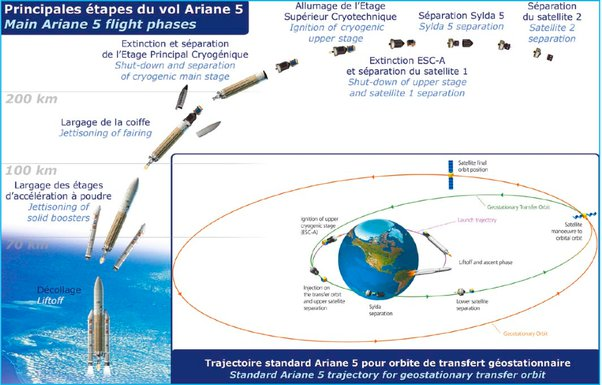

*Article initialement publié sur [Quora](https://fr.quora.com/Pourquoi-un-avion-voyageant-dans-le-sens-oppos%C3%A9-%C3%A0-la-rotation-de-la-Terre-ne-se-d%C3%A9place-t-il-pas-plus-vite-quun-avion-voyageant-dans-le-m%C3%AAme-sens-de-la-rotation-de-la-Terre/answer/Dr-Goulu)*

Plus vite par rapport à quoi ? Un avion se déplace par rapport à l’air qui l’environne, et comme l’atmosphère terrestre tourne avec la Terre, il va à peu près (à la vitesse des vents près) à la même vitesse quelle que soit sa direction par rapport au sol.

Mais pour une fusée, on gagne 0.46 km/s en lançant la fusée depuis une base proche de l’équateur, et vers l’Est. L’avantage est loin d’être négligeable[[1]](#tGNrY) .

Notes de bas de page

[[1]](#cite-tGNrY)[https://lanceurs.destination-orb...](https://lanceurs.destination-orbite.net/performances.php)
