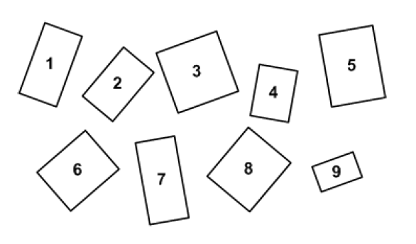
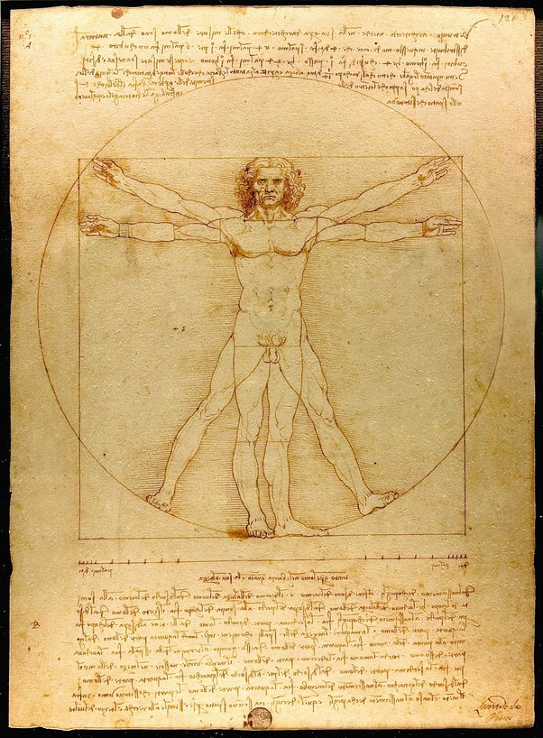

*Article initialement publié sur [Quora](https://fr.quora.com/Pourquoi-le-nombre-dor-est-il-si-important-dans-nos-vies/answer/Dr-Goulu)*

Il ne l’est absolument pas. Même l’idée qu’il définit “des proportions qui plaisent à l’oeil” ne se vérifie pas expérimentalement. Lequel de ces rectangles vous paraît le mieux proportionné ? :

Si vous avez répondu 5, vous avez la même préférence que les 34% des participants à un sondage identique, mais ce n’est pas un rectangle d’or. Le rectangle d’or, c’est le 2, choisi par 18% des gens, mais aussi le 9, choisi par 5%, soit nettement moins que les 11% de moyenne.

Mais Léonard de Vinci, lui, s’y connaissait, n’est-ce pas ? Tout le monde sait que le nombre d’or se trouve dans son célèbre dessin:

Sauf que non : Les proportions que Vinci utilise pour son célèbre [Homme de Vitruve](w:) sont celles conseillées par l’architecte romain [Vitruve](http://www.wikipedia.org/search-redirect.php?language=fr&go=Go&search=Vitruve) : 1/10, 1/4, 1/8 et 1/6. Pas trace de phi.

Et dans la nature ? Pas de nombre d’or non plus, désolé.

[Nombre d'or et abeilles - Pourquoi Comment Combien](/2016/07/03/nombre-dor-et-abeilles/#.XKpmQZiiGCo)
