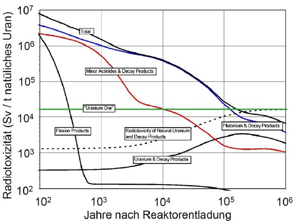

*Article initialement publié sur [Quora](https://fr.quora.com/Quand-la-radioactivit%C3%A9-dun-d%C3%A9chet-cesse-t-elle/answer/Dr-Goulu)*

Quand son dernier atome radioactif devient stable, ce qui peut être très très très long.

Prenons une mole d’un isotope radioactif. Elle contient le Nombre d’Avogadro ( 6.0221409e+23 ) atomes. Après chaque [Période radioactive (ou “demi-vie”),](w:Période_radioactive) il en reste la moitié, donc au bout de log_2(6.0221409e+23) = ~80 demi-vies qu’il y a moins d’une chance sur deux qu’il reste encore un atome de l’isotope initial.

Par exemple pour le [Plutonium 239](w:), la demi-vie est de 24′110 ans, le dernier atome d’une môle disparaît au bout de 1′928′800 ans.

Le problème, c’est que la désintégration d’un atome d’un isotope de “déchet” peut produire un autre isotope dont la demi-vie est plus longue que la première ! Par exemple le Pu239 ci-dessus transmute en [U235](w:Uranium_235) qui a une période de 703 millions d’années, donc le tout reste radioactif beaucoup plus longtemps après la désintégration du dernier atome de plutonium.

Maintenant il faut savoir quelque chose de très important : les substances qui ont **les périodes les plus longues sont les moins radioactives**, simplement parce que moins d’atomes par seconde transmutent en émettant un particule énergétique. Donc la durée de la radioactivité n’a pas vraiment de sens si on ne tient pas compte de l’activité totale, ou de la “radiotoxicité”, ce qui nous intéresse finalement.

Pour des déchets de centrales civiles, en additionnant les divers types de déchets on obtient une courbe de ce type (notez l’échelle log/log):

On y voit que l’activité des déchets diminue d’un premier facteur 10 en 2000 ans environ, puis d’un autre facteur 10 au bout de 40′000 ans environ, et qu’au bout de 200′000 ans, elle devient inférieure à celle du minerai d’Uranium (horizontale verte). C’est le niveau qui est considéré comme acceptable.

[Bure, plongée dans l'éternité - Pourquoi Comment Combien](/2014/05/24/bure-pour-leternite/)
