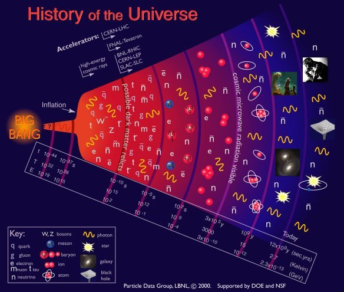

*Article initialement publié sur [Quora](https://fr.quora.com/Que-savez-vous-sur-le-Big-Bang/answer/Dr-Goulu)*

Ce qui est écrit là : [Big Bang — Wikipédia](w:Big_Bang):

> Le Big Bang est un **modèle** cosmologique utilisé par les scientifiques pour **décrire** l'origine et l'évolution de l'[Univers](w:).

Ce n'est donc pas un **événement**, encore moins une **explosion**.

Pour ma part, je suspecte qu'on ne mesure pas le temps correctement.

Quand on a besoin de 20 ordres de grandeur pour décrire quelques chose, il faut passer aux logarithmes. Et sur une échelle log, le Big Bang s'étale depuis moins l'infini…
