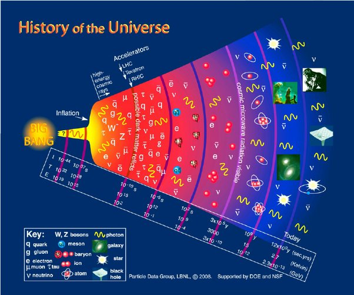

*Article initialement publié sur [Quora](https://fr.quora.com/LUnivers-nen-est-il-qu%C3%A0-ses-d%C3%A9buts/answer/Dr-Goulu)*

Oui. Sur une échelle linéaire du temps, il n’a que 13.8 milliards d’années (10^10 en arrondissant) alors qu’il devrait y avoir des étoiles encore 10^13 ans et que les trous noirs ne seront évaporés que dans 10^100 ans.

( voir [Chronologie du futur lointain — Wikipédia](w:Chronologie_du_futur_lointain) )

Sur une échelle log, il s’est passé au moins 37 ordres de grandeurs avant la première seconde, de là à maintenant il n’y en a eu que 17, et il se passera encore des trucs pendant 90 …

