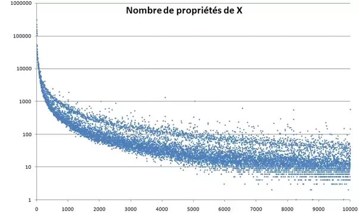

*Article initialement publié sur [Quora](https://fr.quora.com/Le-fait-quun-nombre-soit-acratop%C3%A8ge-nest-il-pas-une-propri%C3%A9t%C3%A9-en-soi/answer/Dr-Goulu)*

C’est la première question qui m’a été posée lorsque j’ai chassé les nombres acratopèges et, je crois, inventé l’expression[[1]](#NdgBq) ;-)

D’abord “[acratopège](https://fr.wiktionary.org/wiki/acratopège)” signifie “sans propriété **particulière**”, pas sans propriété du tout. D’ailleurs chaque entier est soit pair soit impair, donc il a au moins une propriété.

Encore que “impair” peut se comprendre comme “n’ayant pas la propriété d’être pair”, et il en va de même de beaucoup d’autres propriétés des nombres (premier ou composé, carré ou pas etc.)

Donc voilà : les nombres acratopèges ont des propriétés, mais ils en ont moins que leurs voisins. Ils se retrouvent donc au bas de la désormais célèbre figure du “Fossé de Sloane”[[2]](#HZGBX)

Notes de bas de page

[[1]](#cite-NdgBq)[Chasse aux nombres acratopèges - Pourquoi Comment Combien](https://www.drgoulu.com/2008/08/24/nombres-acratopeges/)

[[2]](#cite-HZGBX)[La minéralisation des nombres - Pourquoi Comment Combien](https://www.drgoulu.com/2009/04/18/nombres-mineralises/)
