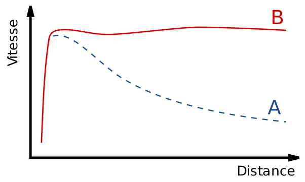

*Article initialement publié sur [Quora](https://fr.quora.com/Pouvez-vous-expliquer-la-mati%C3%A8re-noire-%C3%A0-un-non-physicien/answer/Dr-Goulu)*

J’essaie:

Depuis 1959, on a les moyens de mesurer la [Courbe de rotation des galaxies](w:), qui donne la vitesse moyenne des étoiles en fonction de leur distance au centre de leur galaxie. Normalement, cette courbe devrait diminuer comme la courbe A ci-dessous, comme pour les planètes du système solaire par exemple. Mais pour beaucoup/la plupart/presque toutes* les galaxies, la courbe est beaucoup plus plate, comme la courbe B

Selon la physique classique, la seule manière d’obtenir une telle courbe est que la galaxie soit environnée d’un gros nuage beaucoup plus vaste, avec une forte masse, mais invisible avec tous nos instruments.

Cette “masse manquante” avait déjà été [suspectée dès 1933](w:Matière_noire) lors de l’étude d’amas de galaxies : tout se passe comme si la matière “lumineuse” (étoiles, gaz etc.) ne représentait qu’environ 1/6ème de la masse générant de la gravitation.

On a historiquement appelé les 5/6 èmes de matière hypothétique [Matière noire](w:) car on ne la voit pas, mais on aurait peut-être du l’appeler “matière transparente” car elle n’intercepte pas non plus la lumière ni aucun autre rayonnement.

Aujourd’hui on se demande même si le terme de “matière” est justifié car aucun détecteur du CERN ou d’ailleurs n’a pu détecter la moindre particule qui pourrait composer cette matière ([Weakly interacting massive particles](w:)(WIMP), [Neutrino stérile](w:) etc. ) Certains pensent que c’est peut être la loi de la gravitation elle-même qui doit être modifiée ([Théorie MOND](w:)) ou même notre notion du vide[[1]](#KVgmg) .

Cette dernière approche à l’intérêt de combiner “matière noire” et “[Énergie noire](w:)“ qui se manifestent de manière très différentes, mais qui restent aussi mystérieuses l’une que l’autre.

Note* : il y a des exceptions, et les courbes “B” peuvent prendre toutes sortes de formes intermédiaires jusqu’à A, ce qui fait que la généralisation de ces résultats fait débat. Mais disons qu’on ne connaît que très peu de galaxies avec une courbe A.

Notes de bas de page

[[1]](#cite-KVgmg)[La matière noire et l’énergie noire remises en question](https://www.unige.ch/communication/communiques/2017/cdp211117/)
