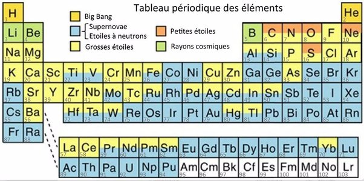

*Article initialement publié sur [Quora](https://fr.quora.com/Quelle-est-l-origine-de-la-diversit%C3%A9-des-%C3%A9l%C3%A9ments-chimiques-existant-dans-l-univers/answer/Dr-Goulu)*

La fusion évoquée par [Jean Onquiert](https://fr.quora.com/profile/Jean-Onquiert) est clairement le moteur de la [Nucléosynthèse stellaire](w:) qui génère beaucoup d’éléments chimiques, surtout jusqu’au fer, mais ce qui peut surprendre est que l’on trouve tous les éléments chimiques du tableau de Mendeleïev à l’extérieur des étoiles.

C’est parce que les étoiles toussent. Quand elles épuisent leur carburant, elles expulsent une partie des atomes qu’elles ont formé dans l’espace. Hubert Reeves disait que nous somme de la “poussière d’étoile” mais je trouve ça un peu trop poétique : nous sommes plutôt des glaires expectorées par des étoiles moribondes…

Et en fait, ces glaires sont souvent gorgées d’isotopes instables, radioactifs, qui décroissent en éléments stables plus ou moins rapidement, formant des éléments que l’étoile n’aurait pas produits directement.

Comme on le voit dans le tableau suivant, il faut en réalité plusieurs types d’étoiles pour produire tous les éléments du tableau:

(Ce tableau montre par une couleur l’origine des différents éléments Northern Arizona University Meteorite Laboratory[[1]](#XkBzA)

Même s’il a été développé dans un contexte différent, j’aime bien le [Principe totalitaire](w:) de Gell-Mann : “*tout ce qui n’est pas interdit est obligatoire.*”

L’Univers est si grand et fait interagir tellement de particules dans les étoiles et les nuages de gaz galactiques qu’il produit tout ce que la physique n’interdit pas.

Notes de bas de page

[[1]](#cite-XkBzA)[NUCLEOSYNTHESE-Observatoire de Paris](http://lastronomieselaraconte.fr/index.php/nucleosynthese)
