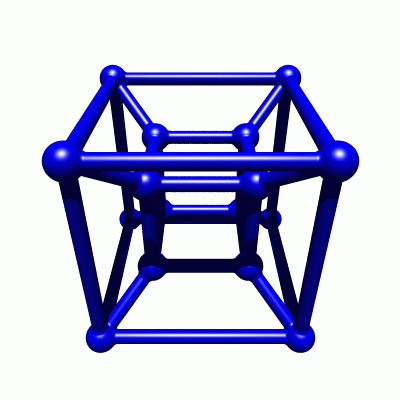

*Article initialement publié sur [Quora](https://fr.quora.com/Comment-peut-on-visualiser-lespace-en-4-dimensions/answer/Dr-Goulu)*

C’est assez facile si on considère qu’un cube est un carré étiré dans la 3ème dimension, alors un hypercube (ou “tesseract”) est un cube étiré dans la 4ème:

Notez que dans illustration ci-dessus le cube est projeté sur le plan à 2 dimensions de l’écran selon un certain angle (45°), et le tesseract à 4 dimensions est aussi projeté sur le même plan selon 2 angles (+45° et -45°)

Si on fixe un de ces deux angles et qu’on fait varier l’autre avec un petit effet de perspective pour simuler la 3D, on voit un tesseract tourner dans l’espace à 3 dimensions:

(cf [Voir en 4 dimensions - Pourquoi Comment Combien](/2007/02/06/voir-en-4-dimensions/#.XMNckWiiGCo))

Maintenant si vous considérez le temps comme la 4ème dimension, ce n’est pas ça du tout car l’espace-temps n’est pas un espace euclidien. C’est un [Espace de Minkowski](w:), dans lequel le temps est une dimension “imaginaire” au sens mathématique du terme . C’est beaucoup plus dur à visualiser …

[Le temps, une 4ème dimension imaginaire - Pourquoi Comment Combien](/2007/02/07/le-temps-une-4eme-dimension-imaginaire/#.XMNeT2iiGCo)
