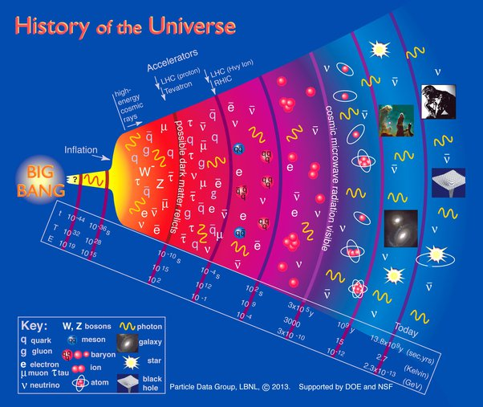

*Article initialement publié sur [Quora](https://fr.quora.com/Comment-est-il-possible-que-l-univers-ait-pu-avoir-exactement-les-quatre-forces-fondamentales-n%C3%A9cessaires-%C3%A0-son-fonctionnement-N-y-aurait-il-pas-pu-avoir-que-les-quarks-les-%C3%A9lectrons-et/answer/Dr-Goulu)*

Il était une fois un Univers qui ne contenait (presque) que des photons, des électrons et des quarks. C’était il y a 13.8 milliards d’années moins une milliseconde environ:

En ce temps là, l’électromagnétisme était “unifié” avec l’interaction faible. C’était la même force, qu’on appelle [Interaction électrofaible.](w:Interaction_électrofaible)

Et avant ça existait très probablement une [Grande unification](w:) englobant aussi l’interaction forte, et plusieurs “[Théorie du tout](w:)” essaient depuis un siècle d’y intégrer encore la gravitation.

Celle qui a le vent en poupe est la [Gravitation quantique à boucles](w:). Elle repose sur une vision différente de l’espace et du temps, et si elle réussit, elle unifierait donc LA force avec l’espace et le temps. (petite introduction ici[[1]](#YdFJS) , et grosse là[[2]](#HWtre))

Bref, peut-être que le seul “fonctionnement” de l’Univers est de se complexifier avec le temps, ou alors nous appelons temps sa dimension orientée dans la direction de sa complexification, au choix…

Notes de bas de page

[[1]](#cite-YdFJS)[Selon Newton, l'univers serait digital - Pourquoi Comment Combien](https://www.drgoulu.com/2011/08/13/selon-newton-lunivers-serait-digital/)

[[2]](#cite-HWtre)[La Renaissance du Temps 1/2 - Pourquoi Comment Combien](https://www.drgoulu.com/2015/01/28/la-renaissance-du-temps/)
