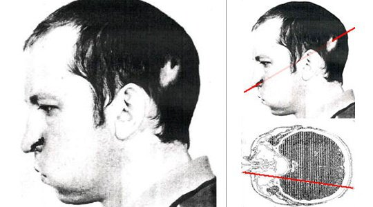

*Article initialement publié sur [Quora](https://fr.quora.com/Quadviendrait-il-dune-personne-%C3%A0-lint%C3%A9rieur-dun-acc%C3%A9l%C3%A9rateur-de-particules/answer/Dr-Goulu)*

Quand c’est voulu, ça peut vous sauver d’un cancer, voir [Protonthérapie — Wikipédia](w:Protonthérapie)

Quand c’est involontaire, c’est moins bon, mais pas forcément fatal.

Anatoli Bugorski est un physicien russe dont la tête s’est retrouvé dans un faisceau de protons d’un accélérateur russe en 1978. On pensait qu’il allait mourir dans les jours suivants vu la dose de radiation reçue, mais à part la perte de l’ouïe d’un côté et une paralysie partielle du visage, il va toujours bien

source : [Anatoli Bugorski a mis sa tête dans un accélérateur de particules](http://www.laboiteverte.fr/anatoli-bugorski-a-mis-sa-tete-dans-un-accelerateur-de-particules/)
