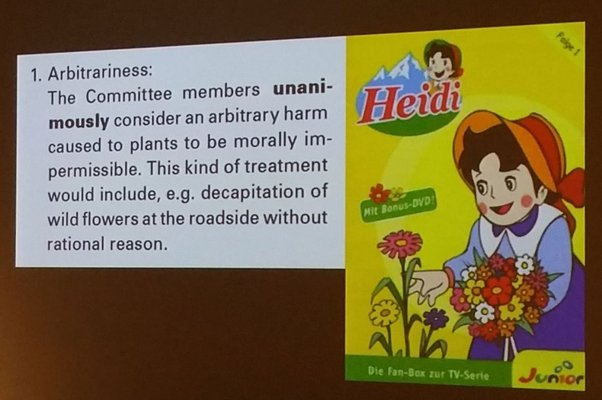

*Réponse publiée [sur Quora](https://fr.quora.com/Pourquoi-est-il-illégal-de-posséder-un-cochon-dinde-en-Suisse/answer/Eléna-Koutoulidis)*

Ca c’est pas faux… Mais on doit se montrer dignes de notre Prix igNobel de la Paix 2008 pour la [Dignité des plantes](https://www.improbable.com/2015/05/21/dignity-and-intelligence-of-plants/) …

(illustration : slide au [IgNobel Award Tour Show](/2016/04/13/ignobel-award-tour-show/) EPFL)
