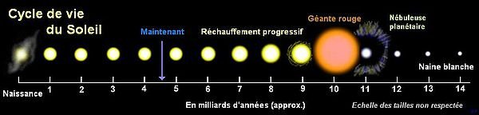

*Article initialement publié sur [Quora](https://fr.quora.com/Comment-calcule-t-on-la-date-de-la-mort-du-Soleil-et-que-va-t-il-arriver-%C3%A0-la-Terre-%C3%A0-ce-moment-l%C3%A0/answer/Dr-Goulu)*

L’[évolution du Soleil](w:Soleil) est connue par l’étude de milliers d’autres étoiles résumée dans le [Diagramme de Hertzsprung-Russell](w:) et la compréhension de leur évolution dans ce diagramme.

Quand le Soleil aura fini de fusionner son hydrogène, il deviendra une géante rouge englobant jusqu’à l’orbite de Vénus. Si la Terre survit, elle ne sera plus qu’un caillou cramé après ça, quand le Soleil sera devenue une naine blanche.

Mais déjà avant ça, le “réchauffement progressif” en cours (qui n’a rien à voir avec le climat, qui évolue beaucoup plus vite) aura déjà porté la surface terrestre à 100°C dans environ 1 milliard d’années.

