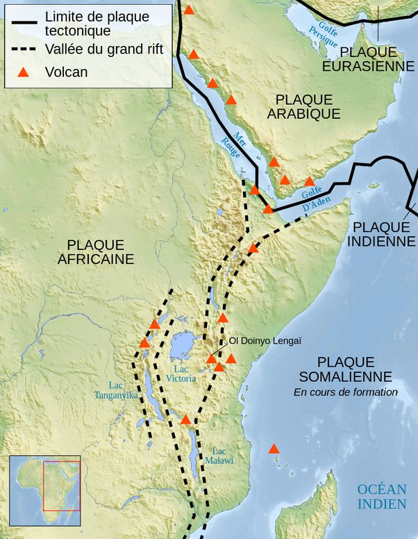

*Article initialement publié sur [Quora](https://fr.quora.com/Est-ce-que-des-continents-peuvent-encore-se-s%C3%A9parer-les-uns-des-autres/answer/Dr-Goulu)*

Oui bien sur. En fait ils le font toujours. Dans les 100 prochains millions d’années, il est surtout prévu que la [Vallée du Grand Rift](w:) en Afrique s’écarte et que la Somalie forme une grosse île

La fin de ce film montre les 100 prochains millions d’années

[https://www.youtube.com/watch?v=...](https://www.youtube.com/watch?v=uGcDed4xVD4)

[Tectonique des plaques: quelles prévisions pour le futur? - Le blog d'Anne-Sophie Krémeur](http://prepa-agreg-svstu-bordeaux.over-blog.com/2013/11/tectonique-des-plaques-quelles-prévisions-pour-le-futur.html)
