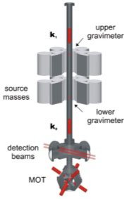

*Article initialement publié sur [Quora](https://fr.quora.com/La-gravit%C3%A9-a-t-elle-d%C3%A9j%C3%A0-%C3%A9t%C3%A9-mesur%C3%A9e-exp%C3%A9rimentalement-entre-deux-atomes/answer/Dr-Goulu)*

1. ce n'est pas possible, car la gravité implique la Terre. Vous voulez sans doute dire "gravitation"[[1]](#UHowH)
2. techniquement, on y arrive pas encore[[2]](#mWzfk).Les problèmes sont:

en pratique on arrive à mesurer G assez bien (10^-4) en laissant tomber des atomes ultrafroids entre des masses[[3]](#ywnHj)et en comparant leur accélération avant et après les masses :

Notes de bas de page

[[1]](#cite-UHowH)[Gravi* (gravité, gravitation, champ gravitationnel, graviton…)](https://reponsesfrequentes.quora.com/Gravi-gravit%C3%A9-gravitation-champ-gravitationnel-graviton)

[[2]](#cite-mWzfk)[http://www.phlam.univ-lille1.fr/...](http://www.phlam.univ-lille1.fr/leshouches/cours14/Tino3a.pdf)

[[3]](#cite-ywnHj)[Magia and gravity measurement](http://coldatoms.lens.unifi.it/index.php/magia-and-gravity/26-research/40-magia-and-gravity.html)
