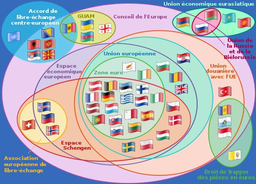

*Article initialement publié sur [Quora](https://fr.quora.com/Quel-impact-le-Brexit-aura-t-il-sur-la-Suisse/answer/Dr-Goulu)*

Je commence par une question : Savez-vous où se retrouvera la Grande-Bretagne après le Brexit dans ce diagramme (tiré de [Politique européenne de voisinage — Wikipédia](w:Politique_européenne_de_voisinage)) ?

Est-ce qu'elle sort aussi de l'Union douanière ? de l' EEE ? du Conseil de l'Europe ? Est-ce qu'elle demandera à rejoindre l'AELE, mais en restant hors-Schengen ?

Répondre à ma question (dont je ne connais pas la réponse…) c'est répondre en partie à la votre, car vous pourrez voir de quel pays la Grande-Bretagne se rapprochera en sortant.

Pour la Suisse bof, on a l'habitude que notre franc soit une monnaie refuge alors si ça se passe mal pour la Livre on va encore avoir un Franc trop fort, la BNS achètera des Livres pour imprimer des Francs, et revendra ensuite ses Livres en faisant un énorme bénef comme la dernière fois avec l'Euro. Les touristes vont continuer à dire que la Suisse est vachement chère etc.

C'est plutôt le nouvel accord cadre Suisse-UE qui va être chaud…
