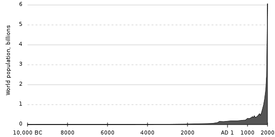

*Article initialement publié sur [Quora](https://fr.quora.com/Comment-calculer-le-nombre-de-morts-depuis-le-d%C3%A9but-des-temps/answer/Dr-Goulu)*

L'estimation actuelle est qu'environ 108 milliards d'humains ont vécu sur Terre

Le calcul est détaillé ici : [Quel est le nombre total de personnes ayant vécu sur la Terre ?](https://www.prb.org/people-ever-lived-fr/) et présenté dans cette vidéo:

[https://www.youtube.com/watch?v=...](https://www.youtube.com/watch?v=mrKPTfXgs4s)

La raison pour laquelle l'estimation dépend assez peu de l' origine de l'humanité considérée à cause de cette courbe :

Comme on le voit une population de quelques milliers, ou même d'un million d'humains pendant des centaines de milliers d'années ne pèse pas lourd à côté des deux derniers millénaires, pour ne pas dire des deux derniers siècles…
