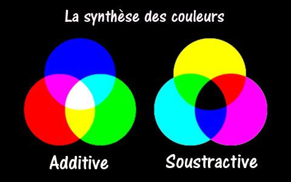

*Article initialement publié sur [Quora](https://fr.quora.com/Que-signifient-additif-et-soustractif-lorsque-lon-parle-des-couleurs/answer/Dr-Goulu)*

ça :

l' "addition" correspond à la superposition de couleurs. Par exemple sur un écran, la couleur d'un pixel est déterminée par les 3 composantes "RGB" (pour rouge vert bleu) . Quand les trois sont à 0, le pixel est noir. Quand les 3 sont au max (1.0 ou 255 selon les standards), le pixel est blanc.

La "soustraction" correspond au mélange de peintures de couleur, chacune "enlevant" un peu de couleur aux autres. Dans l'impression, la superposition des 3 encres de couleur Cyan, Magenta et Jaune permettent de générer toutes les couleurs d'une image.
