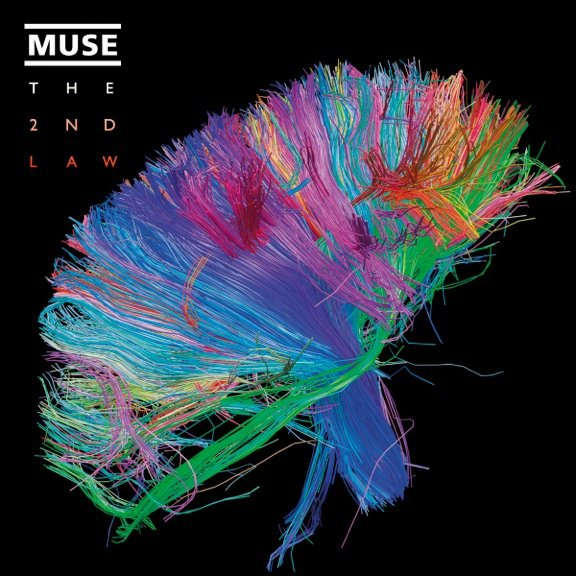

*Article initialement publié sur [Quora](https://fr.quora.com/Jusqu%C3%A0-quel-nombre-de-neurones-pourrions-nous-scanner-et-simuler-un-cerveau-avec-un-supercalculateur-Le-fonctionnement-serait-il-le-m%C3%AAme/answer/Dr-Goulu)*

Selon l'estimation du projet [Human Brain Project](w:) datant de 2013[[1]](#GwRnJ) , il faut une puissance de calcul d' 1 exaflops pour simuler un cerveau, et elle aurait du être disponible en 2018… vérifions : selon la [TOP500 List - June 2019](https://www.top500.org/list/2019/06/) l'ordinateur le plus puissant actuellement du [DOE/SC/Oak Ridge National Laboratory](https://www.top500.org/site/48553) fait 200 petaflops. Il manque un facteur 5, la Loi de Moore ralentit un peu, mais bon d'ici 2024 (fin du projet Blue Brain), on devrait avoir la puissance nécessaire. Si on s'est pas plantés, car l'estimation d'un exaflops est un peu "optimiste" selon certains … Mais on devrait actuellement être à peu près capables de simuler le cerveau d'un rat, si on savait comment les neurones sont connectés…

C'est là qu'intervient le [Brain Activity Map Project](w:) américain. Je le suis d'un peu plus loin et je sais qu'ils ont beaucoup amélioré les IRM pour arriver notamment au [Human Connectome](http://www.humanconnectomeproject.org/) et à des images des connexions du cerveau rendues célèbres par cette couverture de disque :

(en fait c'est en partant de la couverture du disque que j'avais découvert le Human Connectome project …)

Mais à ma connaissance la "Brain initiative" est aussi assez loin de pouvoir produire une carte d'un cerveau humain complet au niveau de chaque neurone, et surtout de chaque synapse…

mais on y arrivera. Pas demain, mais après-demain. Je parie pour 2030.

C'est pour la question"le fonctionnement sera-t-il le même" que j'ai de plus gros doutes. Le cerveau d'a pas seulement des connections il a un "état" instantané qui comprend au moins la concentration en [Neurotransmetteurs](w:Neurotransmetteur)de chacune des 10^15 [Synapses](w:Synapse), et probablement aussi un état chimique encore plus complexes des 10^11 neurones … Sans cette information qui permettrait de "booter" la simulation dans un état donné, on a autant de chances de succès que de ressusciter un humain avec un encéphalogramme plat …

Notes de bas de page

[[1]](#cite-GwRnJ)[Combien de processeurs pour un cerveau ? - Pourquoi Comment Combien](https://www.drgoulu.com/2013/03/11/combien-de-processeurs-pour-un-cerveau/)
