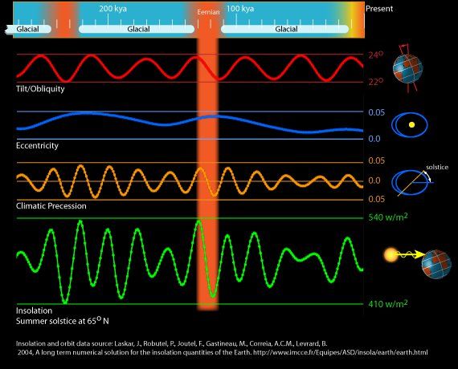

*Article initialement publié sur [Quora](https://fr.quora.com/Quest-ce-que-E%C3%A9mien-Comment-%C3%A9tait-laxe-de-la-terre-%C3%A0-cette-p%C3%A9riode-pourquoi-dit-on-quil-se-rapporte-%C3%A0-une-p%C3%A9riode-glaciaire-et-que-les-hivers-de-lh%C3%A9misph%C3%A8re-Nord-%C3%A9taient/answer/Dr-Goulu)*

L'[Eémien](w:) n'était pas une période glaciaire. C'est au contraire la période interglaciaire entre le glaciaire [saalien](w:) et le glaciaire [vistulien](w:Glaciation_vistulienne) (ou [würmien](w:Glaciation_de_Würm) dans les Alpes).

C'était une période chaude, correspondant grosso modo aux températures actuelles, probablement dues à un maximum des [Paramètres de Milanković.](w:Paramètres_de_Milanković)

Comme on le voit dans le graphique ci-dessous, au début de l'Eémien l'inclinaison de l'axe était comme actuellement très proche des 24° maximaux, par contre l'excentricité de l'orbite terrestre était plus élevée et la précession climatique[[1]](#AsxKR) aussi, ce qui résultait en un éclairement solaire plus important qu'aujourd'hui.

On est donc PAS dans une situation comparable aujourd'hui : le réchauffement actuel est du en grande partie à l'activité humaine, qui se superpose à un petit réchauffement naturel.

Notez bien que le graphique ci-dessus est gradué en "kya" kilo-years. La bande orange représente environ 20'000 ans pendant lesquels la variation de température a été de 6°C. Le réchauffement donc on parle actuellement est de plus de 1°C par siècle. Ca n'a RIEN à voir.

Notes de bas de page

[[1]](#cite-AsxKR)[Site des ressources d'ACCES pour enseigner la Science de la Vie et de la Terre](http://acces.ens-lyon.fr/acces/thematiques/paleo/variations/paleoclimats/syntheses/variations-du-climats/astro/milanko4.htm)
