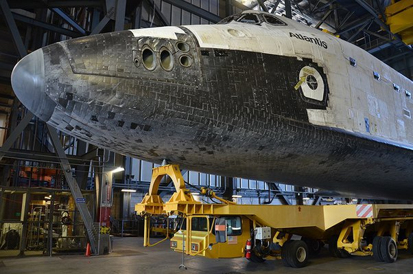

*Article initialement publié sur [Quora](https://fr.quora.com/Comment-la-navette-spatiale-ralentissait-elle-pendant-la-rentr%C3%A9e-atmosph%C3%A9rique-la-descente-et-latterrissage/answer/Dr-Goulu)*

par [Traînée](w:) aérodynamique uniquement. Frottement dans l'air si vous préférez. Le profil de descente est le suivant :

A la rentrée, la navette se cabrait pour exposait son ventre au flux d'air, qui chauffait les tuiles du bouclier thermique jusqu'à plus de 700°C

On voit sur le graphique qu'ainsi elle descendait de 130 à 70 km d'altitude environ en maintenant sa vitesse à peu près constante vers 7.5 km/s.

A la fin, dans les couches basses de l'atmosphère elle se mettait à planer "normalement", mais c'était un très mauvais planeur, avec une finesse aérodynamique de 4 environ, soit comme un parapente actuel.
