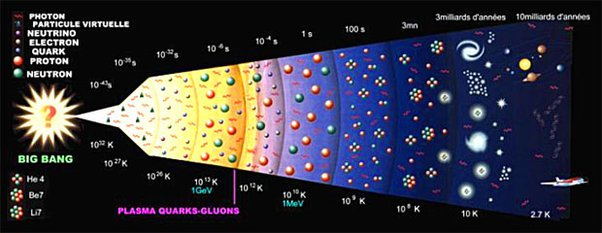
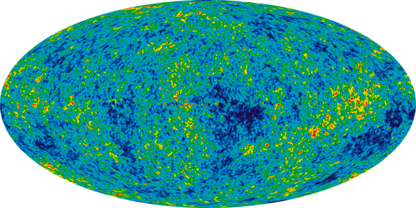

*Article initialement publié sur [Quora](https://fr.quora.com/Si-la-th%C3%A9orie-du-Big-Bang-est-vraie-et-que-tout-a-commenc%C3%A9-%C3%A0-partir-dun-point-comment-des-vides-et-des-super-vides-pourraient-ils-se-former/answer/Dr-Goulu)*

pas un point. Un espace extrêmement dense et chaud, mais peut-être d'une taille infinie. Ce n'est "que" notre [Univers observable](w:) qui était comprimé à la taille de ce point. à un moment donné, et beaucoup plus petit avant.

Comme on le voit dans l'image ci-dessous, dans la première seconde l'univers est passé d'une température de 10^32K (la [Température de Planck](w:), la plus élevée qu'on puisse imaginer) à une température de 10^13 K (correspondant à celle qu'on obtient lors des collisions de particules), ce qui implique un gonflement de l'espace d'un facteur 10^29 en volume, soit 10 milliards en rayon du "point." ci-dessus.

Pendant cette seconde, il n'y avait pas de particules massives (protons, neutrons), donc pas de gravitation. Les premières forces attractives ont été:

- autour de la première seconde, l'[Interaction forte](w:) a lié les quarks pour former les protons et quelques neutrons isolés qui n'ont vécu que quelques quart d'heures
- Après la première minute, l'[Interaction faible](w:) a produit quelques noyaux atomiques pendant la [Nucléosynthèse primordiale](w:)
- Au bout de 300'000 ans l'univers est suffisamment froid pour ne plus être un [État plasma](w:). C'est l'heure de la [Recombinaison](w:Recombinaison_(cosmologie)) : l'[interaction électromagnétique](w:Électromagnétisme) est assez forte pour que les noyaux atomiques capturent des électrons pour former les premiers atomes, électriquement neutres et donc sujets à la gravitation (avant aussi, mais leur énergie et la répulsion électrostatique des noyaux positifs les empêchaient de s'agglomérer).
Accessoirement, ce [Découplage du rayonnement](w:) rend l'Univers transparent à ce moment là. Avant, les photons étaient sans cesse capturés et émis dans tous les sens par le gaz d'électrons.

Le [Fond diffus cosmologique](w:) date de ce moment là. C'est cette fameuse image qu'on voit partout:

Elle montre des variations de température inférieures à 1/10'000 ème de degré à ce moment là, sur une température moyenne de 2.73° au dessus du zero absolu. Ce sont ces microscopiques variations qui, avec l'effet de la gravitation sur 13 milliards d'années, ont causé l'agglomération des galaxies, et la formation des "vides" que vous mentionnez.

Le projet [Illustris](http://www.illustris-project.org/) a réalisé des simulations de cette phase

[https://youtu.be/NjSFR40SY58](https://youtu.be/NjSFR40SY58)
